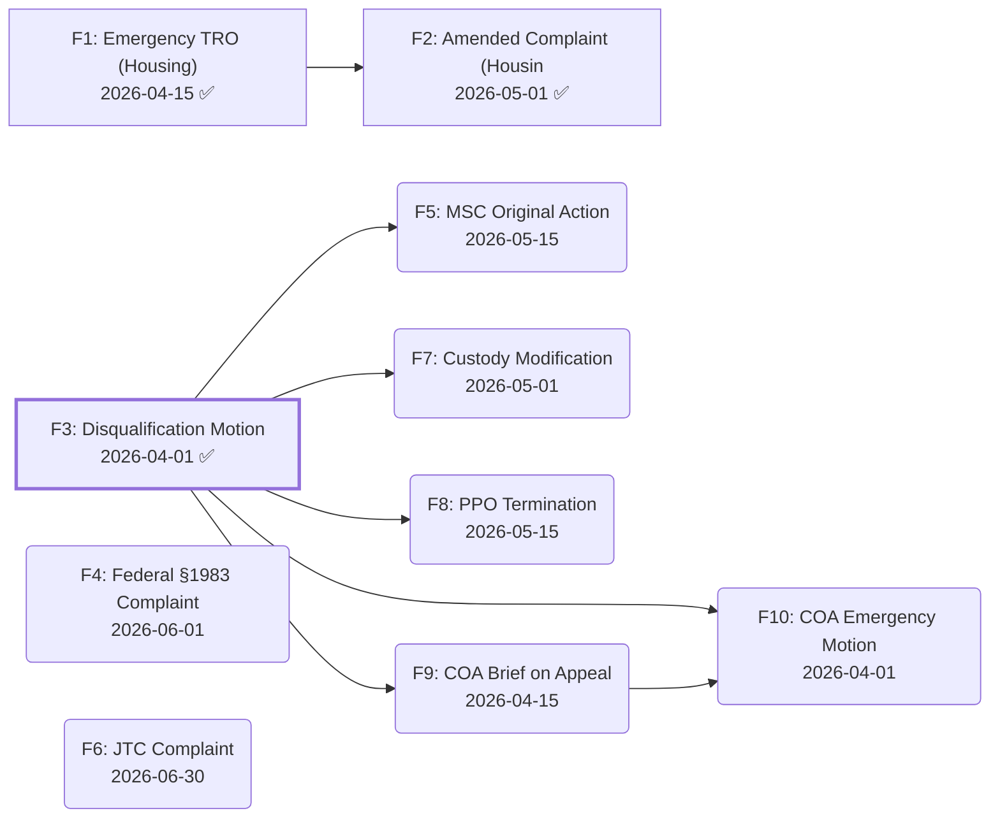

# Filing Dependency Graph

```mermaid
flowchart LR
    F1["F1: Emergency TRO (Housing)<br/>2026-04-15 ✅"]
    F2["F2: Amended Complaint (Housin<br/>2026-05-01 ✅"]
    F3["F3: Disqualification Motion<br/>2026-04-01 ✅"]
    F4("F4: Federal §1983 Complaint<br/>2026-06-01")
    F5("F5: MSC Original Action<br/>2026-05-15")
    F6("F6: JTC Complaint<br/>2026-06-30")
    F7("F7: Custody Modification<br/>2026-05-01")
    F8("F8: PPO Termination<br/>2026-05-15")
    F9("F9: COA Brief on Appeal<br/>2026-04-15")
    F10("F10: COA Emergency Motion<br/>2026-04-01")
    F3 --> F5
    F3 --> F7
    F3 --> F9
    F3 --> F10
    F1 --> F2
    F9 --> F10
    F3 --> F8
    style F1 F2 F3 fill:#90EE90
    style F3 F9 F10 stroke:#FF0000,stroke-width:3px
```
