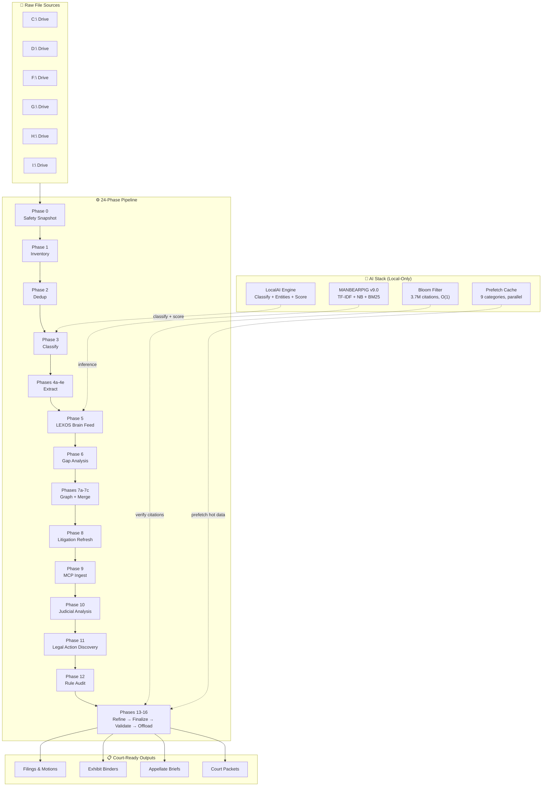
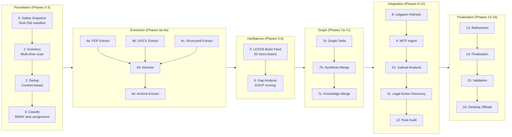
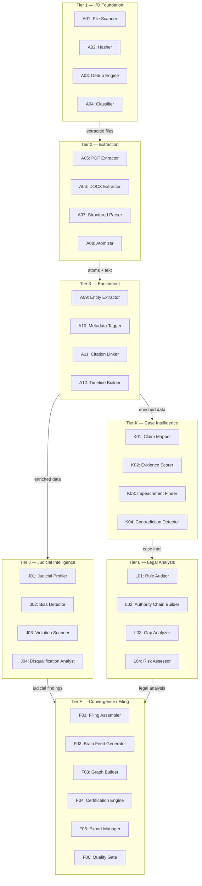
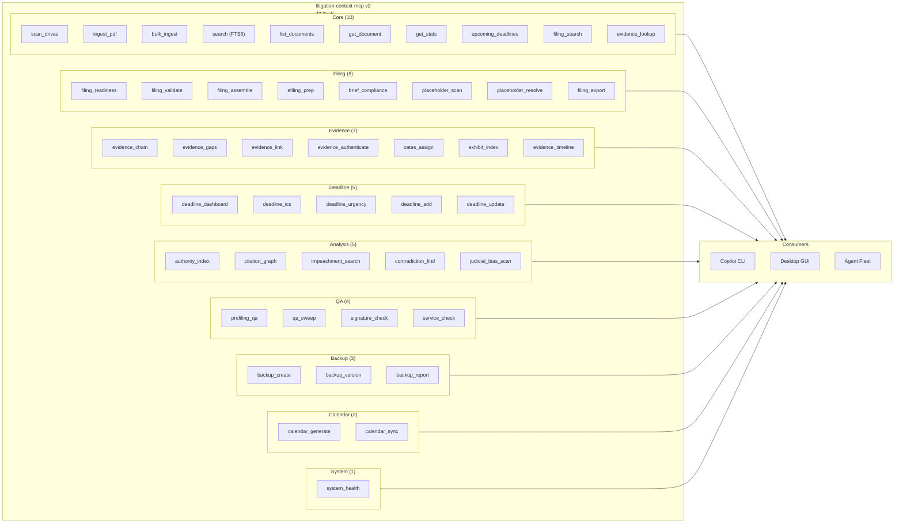
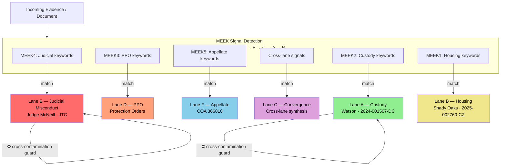

# LitigationOS — Architecture Diagrams

> Generated from verified audit data. Numbers reflect actual system state.

---

## 1. System Overview — Data Flow

---

## 2. Pipeline Phases — 24 Phases with Dependencies

---

## 3. Agent Fleet — 48 Agents in 7 Tiers

---

## 4. Database Landscape — Central DB + Lane DBs

```mermaid
flowchart TD
    subgraph Central["🗄️ Central Database"]
        CDB["litigation_context.db\n702 tables · 10.98 GB\nWAL mode · mmap 12 GB"]
    end

    subgraph LaneDBs["📂 Case Lane Databases"]
        LA["lane_A_custody.db\n2024-001507-DC\n2023-5907-PP"]
        LB["lane_B_housing.db\n2025-002760-CZ"]
        LC["lane_C_convergence.db\nCross-lane data"]
        LD["lane_D_ppo.db\nProtection Orders"]
        LE["lane_E_misconduct.db\nJudicial / JTC"]
        LF["lane_F_appellate.db\nCOA 366810"]
    end

    subgraph Support["🔧 Support Databases"]
        MDB["master_index.db\nAgent data · WAL"]
        MEEK["MEEK_index.db\nLane classification"]
        DI["drive_inventory.db\nMulti-drive file index"]
        DF["document_fulltext.db\nFTS5 full-text search"]
        MCR["mcr_rules.db\nMichigan Court Rules"]
    end

    subgraph Cache["⚡ Performance Layer"]
        BF["Bloom Filter\n~9.6 MB in-memory\n0.01% FP rate"]
        PFC["Prefetch Cache\n9 categories · 50 MB cap\n120s TTL · 6 threads"]
    end

    CDB -->|lane routing| LA
    CDB -->|lane routing| LB
    CDB -->|lane routing| LC
    CDB -->|lane routing| LD
    CDB -->|lane routing| LE
    CDB -->|lane routing| LF

    CDB ---|agent writes| MDB
    CDB ---|classification| MEEK
    CDB ---|file index| DI
    CDB ---|search| DF
    CDB ---|rules| MCR

    CDB -->|3.7M citations| BF
    CDB -->|hot path queries| PFC
```

---

## 5. MCP Tool Categories — 47 Tools

---

## 6. Six Case Lanes — Routing Architecture

---

## Appendix: Performance Module Audit Summary

### Bloom Citation Filter (`bloom_citation_filter.py`)

| Metric | Value |
|--------|-------|
| Target FP rate | 0.01% (1 in 10,000) |
| Memory | ~9.6 MB (bytearray-backed bitfield) |
| Hash function | MurmurHash3 128-bit (Kirsch-Mitzenmacker double-hashing) |
| Data sources | `master_citations` (3.7M rows) + `auth_rules` (1.2K rows) |
| Thread safety | Yes — `threading.Lock` on add, lock-free reads |
| Lazy loading | Yes — double-checked locking via `_ensure_loaded()` |
| Production use | **Yes** — imported by `filing_production_pipeline.py` (line 354), validated by `phase3_validate.py` |
| API | `contains()` O(1), `verify_batch()`, `verify_with_fallback()` (Bloom + DB confirm) |
| Extension potential | High — same `BloomFilter` class works for evidence hashes, filing IDs, or any membership test |

### Prefetch Cache (`prefetch_cache.py`)

| Metric | Value |
|--------|-------|
| Categories cached | 9: claims, evidence, claim_evidence_links, authority, auth_rules, deadlines, filing_readiness, impeachment, judicial_violations |
| Max memory | 50 MB soft cap (size-based eviction) |
| TTL | 120 seconds per entry |
| Parallelism | 6 worker threads via `ThreadPoolExecutor` |
| Invalidation | TTL-based expiry + explicit `invalidate()` + size-based LRU eviction |
| Thread safety | Yes — `threading.Event` per entry for blocking get, `threading.Lock` for store |
| Production use | **Not yet imported** — singleton `cache` is ready but no consumer imports it |
| Schema safety | Validates table/column existence before every query via `PRAGMA table_info()` |
| DB tuning | WAL + mmap 12 GB + 128 MB cache + `query_only=ON` |