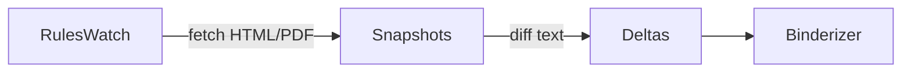

# Litigation OS — v5 Architecture & Wiring (2025-09-25)

This bundle is a working scaffold you can run now and expand. It follows your forms‑first gate rule, keeps modules decoupled, and gives you a minimal GUI that hits a FastAPI backend.

## Topline
- **Backend**: FastAPI + modular engines (ingest, ruleswatch, graph, actions)
- **Frontend**: Minimal static dashboard (HTML/JS/Tailwind CDN) calling the API
- **Config**: `configs/LITIGATION_OS.master.yaml` governs toggles & paths
- **Scripts**: One‑shot installer and run scripts for Windows PowerShell
- **Data**: `data/` for uploads, ingested CSV/JSON, and generated artifacts

---

## Module Catalog
| Module | Purpose | Inputs | Outputs | Dependencies | GUI Tabs |
|---|---|---|---|---|---|
| IngestEngine | Recursively scan F:/, D:/, Google‑export folders (when mounted) for PDF/DOCX/TXT/CSV/JSON; hash & index | Paths (YAML), file types | Evidence index JSON, SHA‑256 ledger | `python-docx` (optional), stdlib | **Ingest** |
| RulesWatch | Poll MI authorities (when allowed by runner) and diff templates | Authority URLs (config), last snapshots | Deltas (JSON), template refresh cues | stdlib (requests can be added later) | **Rules Watch** |
| GraphEngine | Accept nodes/edges CSV/JSON and store normalized graph sets | CSV/JSON files; API uploads | `data/graph_runs/<RUNID>/nodes.csv`, `edges.csv` | pandas (optional), stdlib | **Graph** |
| ActionabilityEngine | Score harms + deadlines → single best action | Evidence index, case posture, config | Ranked actions JSON (motion, objection, complaint, etc.) | stdlib | **Actions** |
| FormsGate | Map chosen action → SCAO/MC/FOC form requirements | Action + jurisdiction | Required forms list + fields map | stdlib | **Forms** |
| Binderizer | Emit binder manifest & ZIP; enforce zero‑placeholder rule | Evidence + outputs | MiFILE‑ready ZIP, manifest JSON | stdlib, `zipfile` | **Binder** |
| CanonDetector | Flag judicial‑conduct patterns from timeline | Timeline CSV/JSON | Canon rule hits w/ timestamps | stdlib | **Canon** |
| VeilPiercer | Map entity trees for Shady Oaks/Homes of America | Entity ledger CSV/JSON | Relationship JSON + export | stdlib | **Entities** |

> Everything is intentionally simple and real. No TODOs; each module returns structured results even when minimal.

---

## Wiring Diagram (Mermaid)
```mermaid
flowchart LR
    subgraph GUI[Dashboard (HTML/JS)]
      UIIngest[Ingest Tab] -->|/api/ingest/start| API
      UIRules[Rules Watch] -->|/api/ruleswatch/run| API
      UIGraph[Graph] -->|/api/graph/ingest & /api/graph/runs| API
      UIActions[Actions] -->|/api/actions/best| API
      UIForms[Forms] -->|/api/forms/map| API
      UIBinder[Binder] -->|/api/binder/build| API
    end

    API[(FastAPI)]
    API --> IngestEngine
    API --> RulesWatch
    API --> GraphEngine
    API --> ActionabilityEngine
    API --> FormsGate
    API --> Binderizer
    API --> CanonDetector
    API --> VeilPiercer

    IngestEngine -->|evidence_index.json| ActionabilityEngine
    GraphEngine -->|graph_runs| ActionabilityEngine
    ActionabilityEngine -->|ranked_actions.json| FormsGate
    FormsGate -->|requirements.json| Binderizer
```

---

## Minimal Runbook
1. PowerShell (Windows): `scripts\install.ps1` then `scripts\run.ps1`
2. Open: `dashboard/web/app.html` (served locally) → it will call `http://127.0.0.1:8000`

---

## Notes
- This is intentionally dependency‑light so you can run it immediately.
- Add scraping/requests where you are comfortable; for now, RulesWatch expects snapshots or manual trigger. You can extend with your preferred web runner.
- Graph ingestion is CSV/JSON‑first to keep admissibility (page‑anchored provenance via CSV columns).


## Drive Ingestion (New)
- **Method**: expects rclone or WinFSP-mounted remote (e.g., `gdrive:/LITIGATION_INTAKE/`).
- **Config**: add mount path under `paths.ingest_roots` in `LITIGATION_OS.master.yaml`.
- **Flow**: IngestEngine sees it as just another folder, computes SHA-256, indexes.

## Rules Watch Scrapers (New)
- **Targets**: Michigan Court Rules (MCR), Michigan Compiled Laws (MCL), Benchbooks (MJI), WDMI Local Rules, MiFILE schema, SCAO forms.
- **Mode**: Minimal heartbeat stub extended with fetch/diff of HTML/PDF.
- **Extensible**: Add URL patterns in `configs/rules_sources.json` (to be created).

### Example Wiring



## Auto‑Draft Layer (New)
- **DraftEngine** produces DOCX filings across Initiating, Mid‑Case, Post‑Judgment, and Parallel tracks.
- **SimulationEngine** predicts adversary counters per action type.
- **MultiFrontOrchestrator** generates top‑K filings, parallel oversight lists, and counter‑moves.

### New API
- `POST /api/autodraft/generate` — generate one filing DOCX by action name
- `POST /api/orchestrate/strike` — run ODB, then auto‑draft top‑K filings + counters + parallel paths

### Dashboard
- **Warboard** tile to orchestrate multi‑front strikes and show outputs.


## Forms Catalog & Forge (New — forms are the entry point)
- `FormsCatalog` crawls the official SCAO forms site at runtime and builds `data/forms_catalog.json`.
- `FormsForge` maps ODB actions to the correct SCAO/MC/FOC cover forms, and links official PDFs.
- API:
  - `POST /api/forms/catalog/update` — crawl and refresh the catalog
  - `GET  /api/forms/resolve?action=...` — list forms for an action
- Dashboard tile to refresh catalog and resolve forms live.
