# LitigationOS Lists Pack — EBNF Keywords + Delta16+ Upgrade Ladder

Generated for Andrew J. Pigors (append-only utility export)

---

## 1) Drive Search Keyword Grammar (EBNF Style)

```ebnf
(* LitigationOS Drive Search Keyword Grammar — EBNF *)
DriveSearchKeywords =
    SeedWords,
    Plane01_AuthorityCore,
    Plane02_FormsVehicles,
    Plane03_DocketRecord,
    Plane04_FamilyCustody,
    Plane05_PPOContempt,
    Plane06_EvidenceTrial,
    Plane07_AppealOversight,
    Plane08_HousingLT,
    Plane09_PartiesEntities,
    Plane10_SearchIntakePackaging
;

SeedWords =
    "benchbooks" |
    "caselaw" |
    "CASESTATE" |
    "FOIA" |
    "LITIGATIONOS" |
    "modelcontextprotocol" |
    "Neill" |
    "Prereqs" |
    "SCAO" |
    "WEAPONIZATION"
;

(* 200 additional keywords below: 10 planes × 20 each *)

Plane01_AuthorityCore =
    "MCR" |
    "MCL" |
    "MRE" |
    "MICourtRules" |
    "MichiganConstitution" |
    "AdminOrders" |
    "LocalAdminOrder" |
    "CourtRule" |
    "Statute" |
    "Canon" |
    "JudicialEthics" |
    "BenchbookFamily" |
    "BenchbookEvidence" |
    "BenchbookCivil" |
    "CourtForms" |
    "FriendOfCourt" |
    "FOC" |
    "AO" |
    "LAO" |
    "PublishedCOA"
;

Plane02_FormsVehicles =
    "MCForm" |
    "FOCForm" |
    "PPOForm" |
    "UCCJEA" |
    "UCSO" |
    "UniformChildSupportOrder" |
    "Motion" |
    "Affidavit" |
    "Declaration" |
    "VerifiedStatement" |
    "ProposedOrder" |
    "NoticeHearing" |
    "NoticePresentment" |
    "ProofService" |
    "CertificateService" |
    "Summons" |
    "Complaint" |
    "Answer" |
    "Countermotion" |
    "Stipulation"
;

Plane03_DocketRecord =
    "ROA" |
    "RegisterActions" |
    "DocketSheet" |
    "DocketEntry" |
    "FilingDate" |
    "SignedDate" |
    "EnteredDate" |
    "ServedDate" |
    "FileStamp" |
    "JudgeOrder" |
    "RefereeRecommendation" |
    "Transcript" |
    "HearingRecording" |
    "MinuteEntry" |
    "CaseHistory" |
    "CaseSummary" |
    "Packet" |
    "Binder" |
    "ExhibitIndex" |
    "ServiceReturn"
;

Plane04_FamilyCustody =
    "Custody" |
    "ParentingTime" |
    "ChildSupport" |
    "LegalCustody" |
    "PhysicalCustody" |
    "JointCustody" |
    "SoleCustody" |
    "BestInterests" |
    "MCL72223" |
    "MCL72227a" |
    "FOCRecommendation" |
    "ParentingSchedule" |
    "HolidaySchedule" |
    "MakeUpTime" |
    "ParentingCoordinator" |
    "ChildExchange" |
    "SupervisedParentingTime" |
    "SuspensionParentingTime" |
    "Modification" |
    "ChangeCircumstances"
;

Plane05_PPOContempt =
    "PPO" |
    "PersonalProtectionOrder" |
    "ExParte" |
    "ShowCause" |
    "Contempt" |
    "CriminalContempt" |
    "CivilContempt" |
    "ViolationPetition" |
    "NoContact" |
    "AmendmentOrder" |
    "ExtensionOrder" |
    "TerminationMotion" |
    "ModifyPPO" |
    "HearingRef" |
    "ReturnHearing" |
    "ServiceAttempt" |
    "ProofPersonalService" |
    "JailCommitment" |
    "Sanctions" |
    "PurgeConditions"
;

Plane06_EvidenceTrial =
    "Exhibit" |
    "ExhibitList" |
    "WitnessList" |
    "Subpoena" |
    "SubpoenaDucesTecum" |
    "EvidenceTag" |
    "ChainOfCustody" |
    "Authentication" |
    "Foundation" |
    "Hearsay" |
    "Objection" |
    "OfferOfProof" |
    "Impeachment" |
    "Admissions" |
    "TextMessages" |
    "CallLogs" |
    "PoliceReport" |
    "MedicalRecord" |
    "EvaluationReport" |
    "RecommendationLetters"
;

Plane07_AppealOversight =
    "ClaimAppeal" |
    "DelayedApplication" |
    "LeaveToAppeal" |
    "SuperintendingControl" |
    "EmergencyMotion" |
    "StayMotion" |
    "COA" |
    "MSC" |
    "JTC" |
    "JudicialTenureCommission" |
    "RecordOnAppeal" |
    "Appendix" |
    "BriefOnAppeal" |
    "QuestionsPresented" |
    "StandardOfReview" |
    "Preservation" |
    "JurisdictionalStatement" |
    "MCR7205" |
    "MCR7212" |
    "MCR7305"
;

Plane08_HousingLT =
    "ShadyOaks" |
    "LandlordTenant" |
    "LTCase" |
    "SummaryProceeding" |
    "MoneyJudgment" |
    "RentLedger" |
    "UtilityBilling" |
    "WaterSewer" |
    "SewerLeak" |
    "Habitability" |
    "MHP" |
    "MobileHomePark" |
    "LeaseExpiration" |
    "RentIncrease" |
    "Overbilling" |
    "NoticeToQuit" |
    "PossessionJudgment" |
    "Damages" |
    "Escrow" |
    "CodeViolations"
;

Plane09_PartiesEntities =
    "AndrewPigors" |
    "EmilyWatson" |
    "Lincoln" |
    "AlbertWatson" |
    "LoriWatson" |
    "CodyWatson" |
    "JennyMcNeill" |
    "Muskegon" |
    "MuskegonCounty" |
    "FourteenthCircuit" |
    "FamilyDivision" |
    "FriendOfCourtOffice" |
    "HealthWest" |
    "HackleyLibrary" |
    "ShadyOaksPark" |
    "ShadyOaksParkMHP" |
    "DispatchCall" |
    "SheriffReturn" |
    "ClerkOffice" |
    "CourtRecorder"
;

Plane10_SearchIntakePackaging =
    "OCR" |
    "Scan" |
    "ScannedOrders" |
    "twoSidedJudgeOrders" |
    "PDF" |
    "DOCX" |
    "TXT" |
    "ZIP" |
    "Intake" |
    "Harvest" |
    "Timeline" |
    "Chronology" |
    "ContradictionMap" |
    "AuthorityTriples" |
    "VehicleMap" |
    "ExhibitMatrix" |
    "Deadlines" |
    "ContextPack" |
    "CyclePack" |
    "Manifest"
;
```

---

## 2) Delta16+ Upgrade Charter (Δ17 → Δ32)

### Δ17 — Deterministic Runtime Core
1. **Transition Executor**
   - `from_state + trigger + guards -> to_state + operator_seq`
   - deterministic transitions
   - replayable runs
   - branch handling (trial / COA / MSC / JTC lanes)

2. **Operator Catalog v1 (formalized)**
   - `OP.INTAKE.UNPACK_ZIP`
   - `OP.RECORD.EXTRACT_ROA`
   - `OP.AUTHORITY.PIN_RULE`
   - `OP.VEHICLE.ROUTE`
   - `OP.FORMS.FILL`
   - `OP.DRAFT.COMPILE`
   - `OP.REDTEAM.HOSTILE_READ`
   - `OP.PACKAGE.CYCLEPACK`

3. **Replay Log Schema**
   - `run_id`
   - `operator_id`
   - inputs/outputs
   - provenance refs
   - assertions added/modified
   - errors
   - confidence/assurance band
   - timing

### Δ18 — Epistemic Brainstem Upgrade
4. **Epistemic Object Registry**
   - `truth_tag` (PROVEN / USER_ASSERTED / RECORD-RECITED / INFERRED / DISPUTED / UNVERIFIED)
   - `proof_status` (OPEN / PARTIAL / SATISFIED)
   - `strategic_value` (high/med/low)
   - `time_sensitivity`
   - `lane_relevance` (Trial / COA / MSC / JTC / Civil)

5. **Claim-to-Proof Obligation Engine**
   - required evidence
   - required authority
   - missing acquisitions
   - admissibility concerns
   - preservation notes

6. **Quote/Pinpoint Resolver v2**
   - source file
   - page/line/para/timecode
   - exact text
   - extraction confidence
   - reopen recipe

### Δ19 — Record Spine / Docket Sovereignty Upgrade
7. **OperatingOrderPin Table**
   - `OrderID`
   - court / judge / case
   - signed/entered/served dates
   - operative verbs
   - supersession edges
   - compliance obligations
   - appeal relevance
   - JTC relevance

8. **ROA/Docket Sync Engine**
   - parse ROA sheets
   - parse scanned register-of-actions
   - parse docket exports
   - parse court notices
   - outputs: docket graph, timeline, missing-entry radar, chain-of-orders

9. **Service & Notice Graph**
   - proofs of service
   - return of service
   - method
   - date
   - target
   - defects
   - notice sufficiency flags

### Δ20 — Authority Plane Upgrade
10. **Authority Registry v2 (full crosswire)**
    - `authority_id`
    - text + official source pointer
    - scope (trial/appellate/JTC)
    - trigger conditions
    - related forms
    - related vehicles
    - evidentiary burdens
    - standards of review
    - sanctions/remedies hooks

11. **Authority Triples Compiler**
    - Rule/Statute/Benchbook triples
    - Rule/Case/Form triples
    - Canon/JTC Procedure/Conduct triples

12. **Conflict & Hierarchy Resolver**
    - hierarchy sort
    - ambiguity flags
    - control-law compass note

### Δ21 — Vehicle & Forms Compiler Upgrade
13. **Vehicle Router v3**
    - best vehicle
    - backup vehicles
    - preserve-now vehicle
    - remedy vehicle
    - evidence-first vehicle
    - escalation vehicle (COA/MSC/JTC)
    - scoring: timeliness, evidence sufficiency, relief probability, risk, downstream impact

14. **Forms-First Compiler**
    - field map
    - required attachments
    - signature/service requirements
    - court-specific formatting notes
    - package sequence

15. **Packet Assembler**
    - cover page
    - motion/application
    - affidavit/declaration
    - brief
    - exhibits
    - exhibit index
    - proof of service
    - notice
    - proposed order
    - filing checklist

### Δ22 — Evidence Atomization Upgrade
16. **Evidence Atom Extractor v3**
    - atomize facts/quotes/names/dates/orders/etc.
    - attach provenance pins
    - classify by lane
    - classify by legal relevance

17. **Admissibility Pre-Check**
    - likely admissibility use
    - foundation requirements
    - hearsay risk
    - authenticity path
    - substitute path if challenged

18. **Contradiction Engine**
    - inconsistent dates
    - inconsistent narratives
    - order-vs-transcript mismatch
    - claim-vs-exhibit mismatch
    - court statement-vs-record mismatch
    - outputs ContradictionMap

### Δ23 — Narrative / Harm / Claim Architecture Upgrade
19. **Harm Corpus Mapper**
    - actions by actor
    - parenting-time harm
    - financial harm
    - liberty harm
    - housing harm
    - procedural harm
    - reputational harm
    - escalation effects

20. **Claim Pattern Miner**
    - potential motions
    - modification paths
    - enforcement paths
    - appellate issues
    - judicial conduct issues
    - civil claim theories (with caution flags)

21. **Narrative Rails Generator**
    - trial factual chronology
    - appellate issue framing
    - JTC conduct narrative
    - affidavit-ready narrative
    - hostile-reader proof map

### Δ24 — Appellate / JTC Precision Upgrade
22. **Preservation Map v2**
    - where raised
    - where ruled
    - objection status
    - transcript citation
    - order citation
    - preservation status
    - fallback framing

23. **Standard-of-Review Mapper**
    - issue → standard of review
    - abuse of discretion
    - clear error
    - de novo
    - constitutional/due process framing
    - plain-error fallback

24. **JTC Conduct Taxonomy Engine**
    - canon mapping
    - irregularity categories
    - record support
    - witness/doc support
    - tone calibration

### Δ25 — Scheduling / Deadline / Calendar Upgrade
25. **Deadline & Trigger Scheduler**
    - filing windows
    - response deadlines
    - service windows
    - acquisition windows
    - appellate timeliness
    - JTC sequencing
    - recurring status checks

26. **Vehicle Deadline Matrix Compiler**
    - prerequisites
    - deadline basis
    - extensions/tolling
    - required record pieces
    - filing destination
    - service targets
    - post-filing next steps

27. **Court Calendar / Event Sync Layer**
    - event parsing
    - hearing type
    - evidentiary flags
    - witness readiness
    - exhibit readiness

### Δ26 — Copilot CLI / MCP / Agent Orchestration Upgrade
28. **Agent Swarm Roles (formal)**
    - Intake Agent
    - Record Spine Agent
    - Authority Agent
    - Vehicle Agent
    - Forms Agent
    - Evidence Agent
    - Contradiction Agent
    - Drafting Agent
    - Red-Team Agent
    - Packaging Agent
    - each with allowed ops / outputs / handoff schema / errors

29. **Skill Registry + Invocation Rules**
    - skill ID
    - purpose
    - inputs/outputs
    - prerequisites
    - confidence requirements
    - fallback skills

30. **MCP Connector Governance**
    - source adapters
    - file-type handlers
    - parser handlers
    - docket adapters
    - authority adapters
    - schema validators

### Δ27 — Command Center UI Upgrade
31. **Litigation Command Center Dashboard**
    - CASE_STATE
    - active deadlines
    - missing acquisitions
    - top issues
    - top vehicles
    - evidence readiness
    - appellate readiness
    - JTC readiness
    - packaging status
    - last-cycle deltas

32. **Bi-Temporal Timeline Viewer**
    - happened_on
    - recorded_on

33. **Plane Views**
    - Authority plane
    - Vehicle plane
    - Evidence plane
    - Contradiction plane
    - Adversary-harm plane
    - Deadline plane
    - Filing-pack plane

### Δ28 — Validation / Red-Team / Hostile Reader Upgrade
34. **Hostile-Read Simulator v2**
    - hostile clerk
    - hostile opposing counsel
    - skeptical judge
    - appellate panel
    - JTC intake reviewer

35. **Failure-Mode Engine**
    - wrong vehicle
    - missing form
    - unsupported assertion
    - missing proof of service
    - deadline ambiguity
    - inadmissible exhibit dependence
    - overclaiming
    - remedy mismatch

36. **Relief-to-Proof Consistency Checker**
    - legal basis present?
    - facts satisfy elements?
    - evidence attached?
    - procedure correct?
    - service path included?

### Δ29 — Packaging / Manifest / LLM Auto-Plan Upgrade
37. **CyclePack vNext**
    - `README_START_HERE.md`
    - `INSTRUCTIONS_STEP_BY_STEP.txt`
    - `LLM_AUTOPLAN.md`
    - `CASE_STATE.md`
    - `VehicleMap.md`
    - `AuthorityTriples.md`
    - `ExhibitMatrix.md`
    - `ContradictionMap.md`
    - `Deadlines.md`
    - `Validation_Report.md`
    - `RunManifest.json`
    - `ReplayLog.jsonl`

38. **Deterministic Naming & Versioning**
    - lane
    - artifact family
    - date
    - cycle
    - integrity key surrogate

39. **Bundle Integrity Harness**
    - ZIP verify
    - manifest completeness
    - file count consistency
    - cross-reference checks

### Δ30 — Source Harvest / Parsing / OCR Upgrade
40. **Adaptive Parsing Pipeline**
    - classify file
    - choose parser
    - OCR only when needed
    - confidence score
    - retry path
    - extraction log

41. **Scanned Orders Specialist Parser**
    - caption extraction
    - file numbers
    - judge name
    - order dates
    - ruling verbs
    - hearing refs
    - signatures
    - handwritten fill-ins

42. **Audio/Transcript Harmonizer**
    - speaker segmentation
    - timeline alignment
    - objection detection
    - ruling snippets
    - preservation candidate extraction

### Δ31 — Strategic AI Layer Upgrade
43. **SBNA Engine v2**
    - urgency
    - parenting-time impact
    - evidentiary readiness
    - preservation benefit
    - downside risk
    - cost/time
    - compounding value

44. **Convergence/Emergence Controller**
    - coverage score
    - contradiction resolution score
    - authority completeness score
    - packet completeness score
    - replay stability score
    - stop threshold on delta gain

45. **Scenario Branching**
    - denial path
    - continuance path
    - evidentiary-hearing path
    - service challenge path
    - testimony-limitation path
    - opposition-affidavit path
    - contingency packet generation

### Δ32 — Productization / Revenue-Grade Upgrade
46. **Tenantized Case Engine**
    - user profile separation
    - jurisdiction profile
    - case lanes
    - authority packs
    - form packs
    - strategy packs

47. **Rules-as-Code Michigan Pack**
    - authority snapshots
    - DFA definitions
    - form routing maps
    - validation rules
    - appellate timing rules

48. **Guided Intake for End Users**
    - legal-structured fact intake
    - evidence upload rails
    - timeline builder
    - contradiction prompts
    - missing-proof acquisition tasks

---

## 3) “Beyond Delta16” Core Conversion Target (Contracts + Compilers + Validators)

Convert the stack into machine contracts:

- **State contract** (what a state means)
- **Operator contract** (what each action does)
- **Object contract** (facts/rules/exhibits/orders)
- **Vehicle contract** (requirements + outputs)
- **Form contract** (fields + attachments)
- **Packet contract** (exact contents)
- **Validation contract** (what fails and why)
- **Replay contract** (reproducibility)

---

## 4) Highest-Leverage Upgrade Sequence (Compasses)

1. **Deterministic Runtime Core** (transition executor + operator catalog + replay logs)
2. **Epistemic Object Registry** (truth tags + proof obligations)
3. **OperatingOrderPin + ROA/Docket Sync** (record spine sovereignty)
4. **Vehicle/Form Compiler** (filing factory)
5. **Validation/Hostile Reader Engine** (denial resistance)
6. **Command Center UI** (situational awareness)
7. **SBNA v2 + Convergence Controller** (autonomous sequencing)

---

## 5) Delta16+ Stretch Upgrades (Beyond Layer)

- **Argument Genome** (argument version lineage)
- **Judge Response Model** (issue/ruling pattern memory)
- **Clerk Acceptance Predictor** (rejection-pattern tuning)
- **Cross-Lane Evidence Reuse Engine** (trial/appeal/JTC/civil reuse)
- **Narrative Compression Ladder** (full corpus → chronology → affidavit → facts section)
- **Adversary Pattern Graph** (pattern-of-conduct by actor with pins)
- **Remedy Portfolio Optimizer** (rights-preservation + leverage compounding)

---

## 6) Resolution Target

The next convergence target is to freeze:

- **Operator Catalog**
- **Transition Table**
- **Epistemic Object Schema**

That trio is the runtime spine. Once frozen, the rest of LitigationOS can scale without drift.
---

# EVENT-HORIZON EXTENSION PACK
## Delta33–Delta64 Runtime Expansion
### Append-Only Continuation for LitigationOS Deterministic Buildout

This section extends the prior **Δ17–Δ32** ladder into a deeper runtime charter focused on compilers, validators, lane-specific packet generators, procedural automata, and adversarial robustness.

## Δ33 — Procedural DFA Compiler (Trial → COA → MSC → JTC)

1. **State Registry Compiler**
   - Canonical state IDs for trial, appellate, and oversight lanes
   - Alias normalization (`show cause`, `OSC`, `order to show cause`)
   - State provenance (rule/statute/order source)

2. **Transition Table Compiler**
   - `from_state + event + guard -> to_state + operator_seq`
   - deterministic ordering of guard evaluation
   - branch capture and replay compatibility

3. **Temporal Constraint Engine**
   - response windows
   - service lead times
   - transcript/order dependency timing
   - rehearing/reconsideration windows
   - appellate timeliness windows

## Δ34 — Court Vehicle Requirement Compiler

1. **Vehicle Requirement Matrix**
   - prerequisites
   - minimum evidence bundle
   - authority anchors
   - required forms
   - filing destination
   - service targets

2. **Vehicle Failure Map**
   - common reject reasons
   - missing attachments
   - wrong venue/court
   - timeliness ambiguity
   - unsupported relief

3. **Vehicle Readiness Score**
   - proof completeness
   - authority coverage
   - packet completeness
   - service readiness
   - downstream strategic value

## Δ35 — Forms Schema Layer (Rules-as-Fields)

1. **Form Field Registry**
   - field key
   - label
   - source-of-truth object
   - formatting rules
   - validation constraints

2. **Attachment Rules Compiler**
   - attachment order
   - mandatory vs optional
   - exhibit references
   - signature dependencies
   - notarization requirements (where applicable)

3. **Field Provenance Pins**
   - every filled field ties back to a fact object or record pin
   - no orphaned values
   - no untraceable autofill

## Δ36 — Order Intelligence Plane

1. **Order Verb Extractor**
   - `ordered`, `denied`, `granted`, `continued`, `suspended`, `shall`
   - detects operative obligations and prohibitions

2. **Supersession Graph**
   - links amended/replaced orders
   - active order chain tracking
   - stale-order warning flags

3. **Compliance Obligation Tracker**
   - who must do what
   - by when
   - proof of compliance artifact
   - noncompliance escalation vehicle suggestions

## Δ37 — Hearing Intelligence Plane

1. **Hearing Taxonomy**
   - evidentiary
   - non-evidentiary
   - show-cause
   - motion hearing
   - trial
   - review/status
   - emergency

2. **Hearing Readiness Pack**
   - witness list status
   - exhibit shortlist
   - objections plan
   - preservation plan
   - relief script

3. **Ruling Capture Template**
   - oral ruling extraction
   - reserved issues
   - written-order follow-up target
   - discrepancy check (oral vs written)

## Δ38 — Preservation and Appeal Safety Plane

1. **Issue Preservation Grid**
   - issue statement
   - where raised
   - objection status
   - ruling status
   - transcript/order pin
   - preservation quality

2. **Appellate Framing Generator**
   - issue framing variants by standard of review
   - constitutional overlay when applicable
   - remedy framing and requested relief

3. **Record Sufficiency Radar**
   - transcript missing
   - order missing
   - exhibit missing
   - proof of service missing
   - factual support thin

## Δ39 — Judicial Conduct / JTC Packaging Plane

1. **Conduct Event Taxonomy**
   - notice/procedure concerns
   - evidentiary asymmetry
   - language/tone concerns
   - off-record handling concerns
   - repeated continuation patterns
   - hearing control restrictions

2. **JTC Narrative Compiler**
   - neutral factual chronology
   - conduct categories
   - supporting record pins
   - requested review framing

3. **JTC Evidence Bundle Router**
   - order pages
   - transcript snippets
   - docket proof
   - notices/service
   - corroborating materials

## Δ40 — Contradiction and Integrity Plane

1. **Contradiction Classes**
   - date contradiction
   - identity contradiction
   - event-order contradiction
   - quote contradiction
   - relief-basis contradiction
   - service contradiction

2. **IntegrityKey Resolver**
   - `BundleUID + EntryPath + CRC32 + bytes + mtime`
   - archive verification checks
   - duplicate detection
   - superseded copy detection

3. **Fact-Law-Link Integrity**
   - every claim links to fact pin + authority pin
   - unresolved claims become acquisition targets
   - unsupported claims blocked from packet promotion

## Δ41 — Search and Retrieval Intelligence Plane

1. **Query Composer Compiler**
   - party + issue + vehicle + date + filetype patterns
   - lane-specific templates (PPO/custody/housing/appeal/JTC)

2. **Search Result Ranking**
   - record relevance
   - procedural relevance
   - recency (when appropriate)
   - source confidence
   - lane match

3. **Acquisition Task Generator**
   - missing transcript request
   - missing order retrieval
   - missing service proof
   - missing hearing notice
   - missing exhibit page

## Δ42 — Multi-Plane Timeline System

1. **Bi-Temporal Event Model**
   - `occurred_at`
   - `recorded_at`
   - `asserted_at`
   - `verified_at`

2. **Timeline Views**
   - factual chronology
   - procedural chronology
   - service chronology
   - harm chronology
   - appellate chronology

3. **Timeline Conflict Resolver**
   - conflicting dates
   - uncertain dates
   - approximate date tags
   - cross-source reconciliation notes

## Δ43 — Harm and Remedy Portfolio Plane

1. **Harm Atom Classes**
   - parenting-time harm
   - liberty harm
   - financial harm
   - housing harm
   - reputational harm
   - procedural harm

2. **Remedy Portfolio Engine**
   - immediate relief
   - preservation relief
   - corrective relief
   - appellate relief
   - oversight relief

3. **Compounding-Value Scoring**
   - does this action strengthen later COA/JTC/civil lanes?
   - does it improve record quality?
   - does it recover parenting-time leverage?

## Δ44 — Drafting Compiler v2

1. **Document Dialects**
   - motion style
   - affidavit style
   - brief style
   - appellate style
   - oversight complaint style

2. **Drop-In Block Library**
   - facts blocks
   - authority blocks
   - relief blocks
   - preservation blocks
   - service blocks
   - exhibit summary blocks

3. **Document Assembly Rules**
   - sequence
   - heading requirements
   - signature blocks
   - caption normalization
   - exhibit references

## Δ45 — Validation and Red-Team Plane v2

1. **Validation Stack**
   - schema validation
   - authority pin validation
   - citation resolution validation
   - packet completeness validation
   - service checklist validation

2. **Hostile Reader Personas**
   - clerk
   - opposing counsel
   - trial judge
   - appellate panel
   - JTC intake reviewer

3. **Remediation Suggestions**
   - auto-generated fixes tied to failure type
   - evidence acquisition suggestions
   - authority strengthening suggestions
   - formatting corrections

## Δ46 — Autonomy and Convergence Controller v2

1. **Cycle Orchestrator**
   - intake cycle
   - parse cycle
   - map cycle
   - route cycle
   - draft cycle
   - validate cycle
   - package cycle

2. **Convergence Metrics**
   - coverage completeness
   - contradiction closure
   - authority completeness
   - packet completeness
   - replay stability
   - validation pass rate

3. **Emergence Targets**
   - new viable vehicles discovered
   - stronger issue framings discovered
   - cross-lane leverage identified
   - record acquisition priorities reprioritized

## Δ47 — Command Center Runtime Plane

1. **Runtime Boards**
   - CASE_STATE
   - VehicleMap
   - ExhibitMatrix
   - ContradictionMap
   - Deadlines
   - Validation Board

2. **Alert Engine**
   - approaching deadlines
   - missing core record docs
   - superseded orders
   - packet regressions
   - lane conflicts

3. **Operator Console**
   - manual override with replay-safe logging
   - operator dry-runs
   - per-lane execution queues

## Δ48 — Michigan Law Pack Management Plane

1. **Law Pack Versioning**
   - MCR/MCL/MRE snapshots
   - form routing versions
   - local procedure notes
   - appellate/JTC templates

2. **Source Resolution Status**
   - unresolved
   - partial
   - verified
   - superseded
   - needs refresh

3. **Law Pack Changelog**
   - changed provisions
   - changed forms
   - changed routing behavior
   - downstream validation impacts

## Δ49 — Narrativity and Rhetorical Precision Plane

1. **Narrative Compression Ladder**
   - full chronology
   - issue chronology
   - affidavit version
   - oral hearing version
   - appellate statement of facts

2. **Tone Calibrators**
   - factual neutral
   - assertive procedural
   - appellate analytical
   - oversight professional

3. **Bias/Inflammation Filter**
   - strips unsupported adjectives
   - flags speculative phrasing
   - preserves high-signal facts and record pins

## Δ50 — Adversary Pattern Graph Plane

1. **Actor Pattern Nodes**
   - actor
   - event category
   - date span
   - harm output
   - record support

2. **Pattern Edge Types**
   - repetition
   - escalation
   - coordination
   - contradiction
   - record asymmetry

3. **Use Views**
   - parenting-time interference pattern
   - procedural pressure pattern
   - evidentiary asymmetry pattern
   - judicial process pattern

## Δ51 — Clerk-Facing Acceptance Plane

1. **Clerk Acceptance Checklist Compiler**
   - caption
   - signatures
   - attachments
   - form pairing
   - fees/waiver checks
   - service docs

2. **Packet Ordering Validator**
   - correct top-to-bottom order
   - exhibit label consistency
   - referenced exhibits present

3. **Reject-Reason Dictionary**
   - exact reject phrasing
   - likely fix
   - refile strategy

## Δ52 — Transcript and Audio Evidence Plane

1. **Transcript Parsing Contracts**
   - page/line capture
   - speaker normalization
   - objections
   - rulings
   - continuances
   - judicial statements

2. **Audio Alignment Contracts**
   - segment IDs
   - timestamp anchors
   - transcript crosswalk
   - confidence values

3. **Preservation Extractor**
   - objection moments
   - denied objections
   - cut-off moments
   - issue mentions
   - ruling language

## Δ53 — Service and Notice Sovereignty Plane

1. **Service Method Catalog**
   - personal
   - mail
   - e-service
   - substituted (if applicable)
   - publication (if applicable)
   - hand-delivery to counsel

2. **Notice Sufficiency Analyzer**
   - lead-time checks
   - hearing notice content checks
   - method-of-service checks
   - proof artifact checks

3. **Defect Escalation Router**
   - corrective notice
   - continuance request
   - objection/preservation note
   - relief request

## Δ54 — Discovery and Evidence Demand Plane

1. **Discovery Vehicle Router**
   - interrogatories
   - requests to produce
   - subpoenas
   - notices to appear
   - motions to compel/protective responses (as applicable)

2. **Request Templates**
   - narrowly tailored asks
   - proof-targeted asks
   - timeline-targeted asks
   - authenticity-targeted asks

3. **Discovery Compliance Tracker**
   - served date
   - due date
   - response quality
   - deficiencies
   - escalation path

## Δ55 — Civil Claim Architecture Plane (Housing + Related)

1. **Claim Scaffold Generator**
   - elements checklist
   - proof obligations
   - damages schema
   - defenses radar
   - procedural vehicle map

2. **Housing Utility Ledger Engine**
   - bill events
   - charges
   - payments
   - dispute flags
   - evidence links

3. **Code/Habitability Crosswalk**
   - condition event
   - notice history
   - repair history
   - damages impact
   - legal hooks

## Δ56 — Parenting-Time Restoration Plane

1. **Parenting-Time Recovery Pack Generator**
   - chronology of denied/excluded time
   - requests made
   - responses/nonresponses
   - order conflicts
   - relief asks

2. **Child-Focused Best-Interest Mapper**
   - factor-linked facts
   - neutral phrasing
   - evidence support
   - hearing-ready summaries

3. **Alienation Pattern Compiler (Evidence-Pinned)**
   - contact interference
   - scheduling interference
   - communication restrictions
   - derogation/conditioning (only where record-supported)

## Δ57 — Child Support and Financial Plane

1. **Support Ledger Compiler**
   - order amounts
   - payments
   - balances
   - fees
   - credits/overpayments
   - arrearage calculations

2. **Income Evidence Registry**
   - wage docs
   - FOIA records
   - income omissions
   - support inputs
   - verification status

3. **Modification Readiness Engine**
   - changed circumstances
   - current income inputs
   - overnights
   - health premium
   - childcare
   - missing inputs radar

## Δ58 — Higher-Court Kit Automation Plane

1. **COA Kit Compiler**
   - claim/application selection
   - jurisdiction statement
   - issues presented
   - statement of facts
   - appendix checklist
   - relief requested

2. **MSC Kit Compiler**
   - leave framing
   - jurisprudential significance framing
   - conflict/precedent framing
   - preservation and posture anchors

3. **JTC Kit Compiler**
   - conduct categories
   - chronology
   - supporting exhibits
   - concise allegations tied to record

## Δ59 — Graph-RAG / Neo4j Contract Plane

1. **Node Contracts**
   - `Case`, `Order`, `Event`, `Fact`, `Authority`, `Vehicle`, `Form`, `Exhibit`, `Actor`, `Deadline`

2. **Edge Contracts**
   - `SUPPORTS`, `CONTRADICTS`, `SUPERSEDES`, `REQUIRES`, `TRIGGERS`, `SERVED_ON`, `CITES`, `RELATES_TO`

3. **Query Packs**
   - "show all orders affecting parenting time"
   - "show all preserved issues with missing transcript pins"
   - "show all vehicles blocked by proof gaps"
   - "show actor pattern timeline by lane"

## Δ60 — Runtime Error Semantics Plane

1. **Error Classes**
   - parser failure
   - unresolved citation
   - missing record
   - validation failure
   - packet assembly failure
   - deadline ambiguity

2. **Recovery Paths**
   - retry parser
   - alternate parser
   - mark acquisition task
   - degrade gracefully
   - partial pack with blockers list

3. **Error Replay Notes**
   - operator context
   - source file
   - stack stage
   - reproducibility fields

## Δ61 — Assurance-Driven Deliberation Plane

1. **Assurance Bands**
   - A: verified/pinned
   - B: strong but incomplete
   - C: plausible needs record
   - D: exploratory only

2. **Band Promotion Rules**
   - evidence pin added
   - authority pin added
   - contradiction resolved
   - validation passed

3. **Band-Specific Drafting Rules**
   - A/B may enter packets
   - C becomes acquisition or red-team note
   - D stays in hypothesis sandbox

## Δ62 — Agent Swarm Contract Plane

1. **Agent Contracts**
   - role
   - allowed operators
   - required output schema
   - escalation triggers
   - handoff targets

2. **Swarm Coordination Rules**
   - no duplicate work
   - replay-safe handoffs
   - deterministic merge ordering
   - conflict resolution protocol

3. **Agent Health Metrics**
   - output validity
   - handoff quality
   - error rate
   - convergence contribution

## Δ63 — Productization / Tenant Plane v2

1. **Jurisdiction Profile Layer**
   - Michigan profile pack
   - county/court overlay notes
   - lane-specific packet presets

2. **User Workspace Isolation**
   - case vaults
   - artifact namespaces
   - shared law-pack references
   - append-only history

3. **Commercial Readiness Track**
   - intake templates
   - onboarding checklists
   - reproducible pack outputs
   - support/debug manifests

## Δ64 — Event-Horizon Sovereign Runtime Commit

1. **Commit Criteria**
   - transition table frozen
   - operator catalog frozen
   - epistemic schema frozen
   - validation stack passing
   - packet compilers operational

2. **Runtime Outputs**
   - deterministic replay logs
   - lane-specific filing packs
   - command center boards
   - acquisition task queues
   - convergence metrics

3. **Next Horizon Targets**
   - live docket sync adapters
   - courts.michigan.gov pinpoint grafting
   - full form-field auto-fill pack
   - production GUI/runtime packaging

---

# Operator Catalog v1 (67 Operators)
## Formal IDs for Deterministic Runtime Execution

### Intake / Source Operators (1–8)
1. `OP.INTAKE.SCAN_SOURCE`
2. `OP.INTAKE.ENUM_FILES`
3. `OP.INTAKE.UNPACK_ZIP`
4. `OP.INTAKE.CLASSIFY_FILE`
5. `OP.INTAKE.SELECT_PARSER`
6. `OP.INTAKE.LOG_INVENTORY`
7. `OP.INTAKE.DEDUPE_ENTRY`
8. `OP.INTAKE.TAG_LANE`

### Record Spine Operators (9–16)
9. `OP.RECORD.EXTRACT_CAPTION`
10. `OP.RECORD.EXTRACT_CASE_ID`
11. `OP.RECORD.EXTRACT_DOCKET_ENTRY`
12. `OP.RECORD.EXTRACT_ORDER_META`
13. `OP.RECORD.EXTRACT_SERVICE_META`
14. `OP.RECORD.NORMALIZE_DATES`
15. `OP.RECORD.BUILD_ROA_GRAPH`
16. `OP.RECORD.LINK_SUPERSESSION`

### Authority Operators (17–24)
17. `OP.AUTHORITY.PARSE_CITATION`
18. `OP.AUTHORITY.NORMALIZE_AUTH_ID`
19. `OP.AUTHORITY.RESOLVE_SOURCE`
20. `OP.AUTHORITY.PINPOINT_TEXT`
21. `OP.AUTHORITY.BUILD_TRIPLE`
22. `OP.AUTHORITY.CHECK_HIERARCHY`
23. `OP.AUTHORITY.LINK_VEHICLE`
24. `OP.AUTHORITY.LINK_FORM`

### Evidence Operators (25–32)
25. `OP.EVIDENCE.EXTRACT_FACT_ATOMS`
26. `OP.EVIDENCE.EXTRACT_QUOTE_ATOMS`
27. `OP.EVIDENCE.PIN_PROVENANCE`
28. `OP.EVIDENCE.CLASSIFY_HARM`
29. `OP.EVIDENCE.CLASSIFY_ADMISSIBILITY`
30. `OP.EVIDENCE.DETECT_CONTRADICTIONS`
31. `OP.EVIDENCE.LINK_EXHIBITS`
32. `OP.EVIDENCE.BUILD_TIMELINE_EVENTS`

### Vehicle / Forms Operators (33–40)
33. `OP.VEHICLE.DETECT_ISSUES`
34. `OP.VEHICLE.ROUTE_PRIMARY`
35. `OP.VEHICLE.ROUTE_BACKUP`
36. `OP.VEHICLE.SCORE_READINESS`
37. `OP.FORMS.SELECT_PACKET_FORMS`
38. `OP.FORMS.MAP_FIELDS`
39. `OP.FORMS.VALIDATE_ATTACHMENTS`
40. `OP.FORMS.BUILD_PACKET_SEQUENCE`

### Drafting Operators (41–48)
41. `OP.DRAFT.GENERATE_FACT_BLOCK`
42. `OP.DRAFT.GENERATE_AUTHORITY_BLOCK`
43. `OP.DRAFT.GENERATE_RELIEF_BLOCK`
44. `OP.DRAFT.GENERATE_PRESERVATION_BLOCK`
45. `OP.DRAFT.GENERATE_SERVICE_BLOCK`
46. `OP.DRAFT.ASSEMBLE_DOCUMENT`
47. `OP.DRAFT.ASSEMBLE_PACKET`
48. `OP.DRAFT.GENERATE_ACQUISITION_TASKS`

### Validation / Red-Team Operators (49–56)
49. `OP.VALIDATE.SCHEMA_CHECK`
50. `OP.VALIDATE.CITATION_RESOLVE_CHECK`
51. `OP.VALIDATE.PROOF_OBLIGATION_CHECK`
52. `OP.VALIDATE.PACKET_COMPLETENESS_CHECK`
53. `OP.VALIDATE.SERVICE_CHECK`
54. `OP.REDTEAM.HOSTILE_CLERK_REVIEW`
55. `OP.REDTEAM.HOSTILE_JUDGE_REVIEW`
56. `OP.REDTEAM.HOSTILE_APPEAL_REVIEW`

### Runtime / Packaging Operators (57–67)
57. `OP.RUNTIME.WRITE_REPLAY_LOG`
58. `OP.RUNTIME.WRITE_RUN_MANIFEST`
59. `OP.RUNTIME.UPDATE_CASE_STATE`
60. `OP.RUNTIME.UPDATE_METRICS`
61. `OP.RUNTIME.ENQUEUE_NEXT_CYCLE`
62. `OP.PACKAGE.WRITE_README`
63. `OP.PACKAGE.WRITE_INSTRUCTIONS`
64. `OP.PACKAGE.WRITE_AUTOPLAN`
65. `OP.PACKAGE.WRITE_ARTIFACTS`
66. `OP.PACKAGE.VERIFY_BUNDLE`
67. `OP.PACKAGE.EMIT_CYCLEPACK`

---

# Transition Guard Catalog (32)
## Guard IDs used by the Transition Table Compiler

1. `G.RECORD.CASE_ID_PRESENT`
2. `G.RECORD.CAPTION_PRESENT`
3. `G.RECORD.ORDER_DATE_PRESENT`
4. `G.RECORD.SERVICE_PROOF_PRESENT`
5. `G.RECORD.TRANSCRIPT_AVAILABLE`
6. `G.RECORD.EXHIBITS_INDEXED`
7. `G.AUTHORITY.MIN_TRIPLES_READY`
8. `G.AUTHORITY.PINPOINTS_RESOLVED`
9. `G.EVIDENCE.FACT_ATOMS_MIN_READY`
10. `G.EVIDENCE.KEY_HARMS_CLASSIFIED`
11. `G.EVIDENCE.CONTRADICTIONS_MAPPED`
12. `G.TIMELINE.CHRONOLOGY_BUILT`
13. `G.VEHICLE.PRIMARY_SELECTED`
14. `G.VEHICLE.PREREQS_SATISFIED`
15. `G.VEHICLE.DEADLINE_CLEAR`
16. `G.VEHICLE.SERVICE_ROUTE_CLEAR`
17. `G.FORMS.FIELD_MAP_READY`
18. `G.FORMS.REQUIRED_ATTACHMENTS_READY`
19. `G.DRAFT.FACT_BLOCK_READY`
20. `G.DRAFT.AUTH_BLOCK_READY`
21. `G.DRAFT.RELIEF_BLOCK_READY`
22. `G.DRAFT.PACKET_ASSEMBLED`
23. `G.VALIDATE.SCHEMA_PASS`
24. `G.VALIDATE.CITATION_PASS`
25. `G.VALIDATE.PROOF_PASS`
26. `G.VALIDATE.PACKET_PASS`
27. `G.REDTEAM.CLERK_PASS`
28. `G.REDTEAM.JUDGE_PASS`
29. `G.REDTEAM.APPEAL_PASS`
30. `G.RUNTIME.MANIFEST_WRITTEN`
31. `G.RUNTIME.REPLAY_WRITTEN`
32. `G.PACKAGE.BUNDLE_VERIFIED`

---

# Epistemic Object Registry Enums
## Canonical enums for facts, claims, evidence, and authority objects

### `truth_tag`
- `PROVEN`
- `RECORD_RECITED`
- `USER_ASSERTED`
- `INFERRED`
- `UNVERIFIED`
- `DISPUTED`

### `proof_status`
- `OPEN`
- `PARTIAL`
- `SATISFIED`
- `BLOCKED`
- `SUPERSEDED`

### `strategic_value`
- `CRITICAL`
- `HIGH`
- `MEDIUM`
- `LOW`
- `BACKGROUND`

### `time_sensitivity`
- `IMMEDIATE`
- `URGENT`
- `NEAR_TERM`
- `ROUTINE`
- `ARCHIVAL`

### `lane_relevance`
- `TRIAL`
- `COA`
- `MSC`
- `JTC`
- `CIVIL`
- `HOUSING`
- `MULTI_LANE`

### `assurance_band`
- `A_VERIFIED`
- `B_STRONG`
- `C_PARTIAL`
- `D_EXPLORATORY`

---

# Replay Log JSONL Field Set (Suggested)
## Core runtime fields for deterministic replay and audit

1. `run_id`
2. `cycle_id`
3. `event_id`
4. `operator_id`
5. `operator_version`
6. `from_state`
7. `to_state`
8. `guard_results`
9. `input_refs`
10. `output_refs`
11. `artifact_refs`
12. `record_pins_added`
13. `authority_pins_added`
14. `fact_atoms_added`
15. `contradictions_added`
16. `proof_obligations_opened`
17. `proof_obligations_closed`
18. `assurance_promotions`
19. `errors`
20. `warnings`
21. `duration_ms`
22. `timestamp_utc`
23. `lane`
24. `case_id`
25. `integrity_key`

---

# RunManifest Field Set (Suggested)

- `run_id`
- `cycle_id`
- `generated_at`
- `workspace_id`
- `case_lanes`
- `sources_scanned`
- `files_seen`
- `files_processed`
- `files_failed`
- `artifacts_emitted`
- `bundle_path`
- `bundle_verified`
- `replay_log_path`
- `validation_report_path`
- `convergence_metrics`
- `next_cycle_targets`

---

# Query Composer EBNF (Drive / Vault / Connector Search)
## Search-string generator grammar for deterministic retrieval

```ebnf
Query            = LaneBlock, " ", CoreBlock, [ " ", DateBlock ], [ " ", FileTypeBlock ], [ " ", CourtBlock ] ;
LaneBlock        = PPOBlock | CustodyBlock | HousingBlock | AppealBlock | JTCBlock | MixedBlock ;

PPOBlock         = "PPO" | "ShowCause" | "Contempt" | "ExParte" | "ExtensionOrder" ;
CustodyBlock     = "Custody" | "ParentingTime" | "ChildSupport" | "FOCRecommendation" ;
HousingBlock     = "ShadyOaks" | "LandlordTenant" | "UtilityBilling" | "SewerLeak" | "RentLedger" ;
AppealBlock      = "COA" | "MSC" | "ClaimAppeal" | "LeaveToAppeal" | "RecordOnAppeal" ;
JTCBlock         = "JTC" | "JudicialTenureCommission" | "Canon" | "JudicialEthics" ;
MixedBlock       = "CASESTATE" | "LITIGATIONOS" | "SCAO" | "Neill" ;

CoreBlock        = PartyToken | RecordToken | OrderToken | EvidenceToken | FormToken | VehicleToken ;
PartyToken       = "AndrewPigors" | "EmilyWatson" | "JennyMcNeill" | "AlbertWatson" | "LoriWatson" | "Lincoln" ;
RecordToken      = "ROA" | "Docket" | "RegisterActions" | "NoticeHearing" | "ProofService" ;
OrderToken       = "JudgeOrder" | "AmendmentOrder" | "OrderAfterHearing" | "ProposedOrder" ;
EvidenceToken    = "Exhibit" | "Transcript" | "PoliceReport" | "EvaluationReport" | "TextMessages" ;
FormToken        = "MCForm" | "FOCForm" | "PPOForm" | "UCSO" ;
VehicleToken     = "Motion" | "Affidavit" | "BriefOnAppeal" | "SuperintendingControl" ;

DateBlock        = Year | YearMonth | NamedDate ;
Year             = "2023" | "2024" | "2025" | "2026" ;
YearMonth        = Year, "-", Month ;
Month            = "01" | "02" | "03" | "04" | "05" | "06" | "07" | "08" | "09" | "10" | "11" | "12" ;
NamedDate        = "July17Trial" | "Nov17Video" | "PPOExtension" | "ShowCause6" | "ShowCause7" ;

FileTypeBlock    = "PDF" | "DOCX" | "TXT" | "ZIP" | "ScannedOrders" ;
CourtBlock       = "Muskegon" | "14thCircuit" | "FamilyDivision" | "FriendOfCourt" ;
```

---

# Artifact Family List (Event-Horizon Runtime Outputs)
## Core artifacts the runtime should always know how to emit

1. `CASE_STATE.md`
2. `VehicleMap.md`
3. `ContextPack.md`
4. `SoRLedger_Delta.md`
5. `ExhibitMatrix.md`
6. `BiTemporalTimeline.md`
7. `AuthorityTriples.md`
8. `ContradictionMap.md`
9. `Deadlines.md`
10. `Validation_Report.md`
11. `PreservationMap.md`
12. `OperatingOrderPins.md`
13. `JTC_Conduct_Map.md`
14. `COA_IssueGrid.md`
15. `MSC_Leave_Frame.md`
16. `Housing_Claim_Architecture.md`
17. `ChildSupport_Ledger_Analysis.md`
18. `ParentingTime_Restoration_Pack.md`
19. `RunManifest.json`
20. `ReplayLog.jsonl`

---

# Convergence Metrics List
## Runtime metrics for “keep pushing until signal flattens”

### Coverage Metrics
- `coverage.record_spine_pct`
- `coverage.order_chain_pct`
- `coverage.service_chain_pct`
- `coverage.timeline_pct`
- `coverage.authority_triples_pct`
- `coverage.exhibit_index_pct`

### Quality Metrics
- `quality.pinpoint_resolution_pct`
- `quality.validation_pass_pct`
- `quality.redteam_pass_pct`
- `quality.replay_stability_pct`
- `quality.packet_completeness_pct`

### Strategy Metrics
- `strategy.primary_vehicle_ready_count`
- `strategy.backup_vehicle_ready_count`
- `strategy.preservation_issues_mapped`
- `strategy.deadline_risks_open`
- `strategy.acquisition_tasks_open`

### Emergence Metrics
- `emergence.new_vehicle_candidates`
- `emergence.new_issue_frames`
- `emergence.cross_lane_reuse_links`
- `emergence.contradictions_closed_cycle_delta`

---

# Mermaid Cascading Planes — Delta33→Delta64
## Visual map of the new upgrade planes

```mermaid
flowchart TB
  EH["EVENT-HORIZON EXTENSION"]
  EH --> D33["Δ33 Procedural DFA Compiler"]
  D33 --> D34["Δ34 Vehicle Requirement Compiler"]
  D34 --> D35["Δ35 Forms Schema Layer"]
  D35 --> D36["Δ36 Order Intelligence"]
  D36 --> D37["Δ37 Hearing Intelligence"]
  D37 --> D38["Δ38 Preservation / Appeal Safety"]
  D38 --> D39["Δ39 JTC Packaging Plane"]
  D39 --> D40["Δ40 Contradiction / Integrity"]
  D40 --> D41["Δ41 Search / Retrieval Intelligence"]
  D41 --> D42["Δ42 Multi-Plane Timeline"]
  D42 --> D43["Δ43 Harm / Remedy Portfolio"]
  D43 --> D44["Δ44 Drafting Compiler v2"]
  D44 --> D45["Δ45 Validation / Red-Team v2"]
  D45 --> D46["Δ46 Autonomy / Convergence v2"]
  D46 --> D47["Δ47 Command Center Runtime"]
  D47 --> D48["Δ48 Michigan Law Pack Mgmt"]
  D48 --> D49["Δ49 Narrative Precision"]
  D49 --> D50["Δ50 Adversary Pattern Graph"]
  D50 --> D51["Δ51 Clerk Acceptance Plane"]
  D51 --> D52["Δ52 Transcript/Audio Plane"]
  D52 --> D53["Δ53 Service/Notice Sovereignty"]
  D53 --> D54["Δ54 Discovery Plane"]
  D54 --> D55["Δ55 Civil Claim Architecture"]
  D55 --> D56["Δ56 Parenting-Time Restoration"]
  D56 --> D57["Δ57 Child Support / Financial"]
  D57 --> D58["Δ58 Higher-Court Kit Automation"]
  D58 --> D59["Δ59 Graph-RAG / Neo4j Contracts"]
  D59 --> D60["Δ60 Runtime Error Semantics"]
  D60 --> D61["Δ61 Assurance Deliberation"]
  D61 --> D62["Δ62 Agent Swarm Contracts"]
  D62 --> D63["Δ63 Tenant/Product Plane"]
  D63 --> D64["Δ64 Sovereign Runtime Commit"]
```



---

# EVENT-HORIZON Continuation Targets
## Highest-signal next compilation targets after this pack

1. **Transition Table CSV/JSON Spec**
   - formal rows for `from_state`, `event`, `guards`, `to_state`, `operators`

2. **Operator Catalog JSON Contract**
   - machine-readable definitions for all 67 operators

3. **Epistemic Object JSON Schema (Draft 2020-12)**
   - `truth_tag`, `proof_status`, `pins`, `assurance_band`, `lane_relevance`

4. **RunManifest JSON Schema + Pydantic models**
   - validator-ready contract for replay-safe execution

5. **Packet Compiler Field Maps**
   - forms-first routing maps for trial / COA / MSC / JTC lanes

6. **Hostile-Reader Validation Ruleset**
   - deterministic failure checks tied to remediation suggestions

---
---

# EVENT-HORIZON EXTENSION PACK v3
## Delta65–Delta96 + Runtime Spec Contracts
### Deterministic Runtime Contracts, Schemas, and Compiler Targets

This continuation pushes the pack beyond upgrade ladders into **concrete runtime contracts**:
- transition-table machine schema
- operator catalog machine schema
- epistemic object schema
- deterministic IDs
- replay-safe state transitions
- validator contracts
- packet compiler contracts

## Δ65 — Transition Table Runtime Contract Plane

1. **Transition Row Contract**
   - `transition_id`
   - `from_state`
   - `event`
   - `guards_all[]`
   - `guards_any[]`
   - `guards_not[]`
   - `operator_seq[]`
   - `to_state`
   - `on_fail_state`
   - `priority`
   - `lane_scope`
   - `notes`

2. **Transition Determinism Rules**
   - sort by priority asc, then `transition_id`
   - guards evaluated in stable order
   - first matching row wins unless `multi_fire=true`
   - all guard outcomes logged

3. **Transition Failure Semantics**
   - `NO_MATCH`
   - `GUARD_ERROR`
   - `OPERATOR_ERROR`
   - `STATE_CONFLICT`
   - `REPLAY_DRIFT`

## Δ66 — State Registry Contract Plane

1. **State Object Fields**
   - `state_id`
   - `lane`
   - `phase`
   - `human_label`
   - `description`
   - `entry_conditions`
   - `exit_conditions`
   - `source_anchors[]`

2. **State Alias Resolver**
   - supports canonical names and aliases
   - examples: `OSC` → `ORDER_TO_SHOW_CAUSE`, `ROA` → `REGISTER_OF_ACTIONS`

3. **State Invariants**
   - no duplicate `state_id`
   - lane/phase required
   - every transition state must exist in registry

## Δ67 — Event Contract Plane

1. **Event Object Fields**
   - `event_id`
   - `event_type`
   - `event_source`
   - `observed_at`
   - `occurred_at`
   - `lane`
   - `payload_ref`
   - `integrity_key`

2. **Event Classes**
   - `FILE_INGESTED`
   - `ORDER_PARSED`
   - `HEARING_FOUND`
   - `SERVICE_PROOF_FOUND`
   - `TRANSCRIPT_PARSED`
   - `DEADLINE_COMPUTED`
   - `PACKET_VALIDATED`
   - `BUNDLE_EMITTED`

3. **Event Replay Rules**
   - events immutable
   - event ordering by `observed_at` then `event_id`
   - duplicate event suppression by `(event_type, integrity_key)`

## Δ68 — Deterministic ID Plane

1. **ID Strategy**
   - deterministic IDs from normalized payload fields
   - no random UUIDs for replay-critical objects

2. **Canonical ID Formula**
   - `prefix + "_" + base32(sha256(normalized_key_string))[:20]`
   - example prefixes: `EVT`, `ORD`, `FAC`, `AUT`, `VEH`, `PKT`, `TRN`

3. **Normalization Rules**
   - lowercase
   - trim whitespace
   - collapse spaces
   - stable field order
   - dates in ISO format
   - nulls rendered as `~`

## Δ69 — Deterministic ID Test Vector Plane

1. **Golden Vector Pack**
   - same input always same ID
   - field-order drift check
   - whitespace drift check
   - case drift check
   - null-value normalization check

2. **Cross-Platform Determinism**
   - Python / JS / PowerShell output parity required

3. **Replay Drift Alarms**
   - if regenerated ID differs from stored ID, flag `REPLAY_DRIFT`

## Δ70 — Operator Catalog JSON Contract Plane

1. **Operator Definition Fields**
   - `operator_id`
   - `version`
   - `name`
   - `category`
   - `inputs_schema_ref`
   - `outputs_schema_ref`
   - `preconditions[]`
   - `postconditions[]`
   - `failure_codes[]`
   - `side_effects[]`

2. **Operator Purity Classes**
   - `PURE` (no side effects)
   - `WRITE_LOCAL`
   - `WRITE_GRAPH`
   - `WRITE_PACKET`
   - `NETWORK_READ`
   - `NETWORK_WRITE`

3. **Operator Replay Policy**
   - replay-safe operators must declare determinism level
   - side effects must emit artifact refs and integrity keys

## Δ71 — Guard Evaluation Engine Plane

1. **Guard Contract**
   - `guard_id`
   - `description`
   - `inputs[]`
   - `logic`
   - `severity_on_fail`

2. **Guard Result Object**
   - `guard_id`
   - `passed`
   - `reason`
   - `evidence_refs[]`
   - `timestamp_utc`

3. **Guard Bundles**
   - `record_minimum_bundle`
   - `appeal_readiness_bundle`
   - `jtc_readiness_bundle`
   - `packet_emit_bundle`

## Δ72 — Epistemic Object Schema Plane v2

1. **Epistemic Object Types**
   - `fact_atom`
   - `quote_atom`
   - `authority_pin`
   - `record_pin`
   - `claim_atom`
   - `issue_atom`
   - `deadline_atom`

2. **Core Fields**
   - `object_id`
   - `object_type`
   - `truth_tag`
   - `proof_status`
   - `assurance_band`
   - `lane_relevance[]`
   - `strategic_value`
   - `time_sensitivity`
   - `text`
   - `pins[]`
   - `links[]`

3. **Promotion Rules**
   - no `claim_atom` promoted to packet if missing both authority pin and record pin
   - `INFERRED` facts require explicit inference note

## Δ73 — Pinpoint Resolver Contract Plane

1. **Pin Types**
   - `page_line`
   - `page_para`
   - `timecode`
   - `docket_entry`
   - `form_field`
   - `image_region`

2. **Pin Object Fields**
   - `pin_id`
   - `source_ref`
   - `locator_type`
   - `locator_value`
   - `quoted_text`
   - `confidence`
   - `reopen_recipe`

3. **Quote Discipline**
   - exact quote or mark unresolved
   - paraphrase must still carry pin

## Δ74 — Timeline Schema Plane

1. **Timeline Event Object**
   - `timeline_event_id`
   - `event_kind`
   - `occurred_at`
   - `recorded_at`
   - `asserted_by`
   - `verified_by`
   - `actors[]`
   - `source_pins[]`
   - `lane_relevance[]`

2. **Timeline Merge Rules**
   - merge duplicates by event similarity + pins
   - preserve conflicting variants with `DISPUTED` flags

3. **Chronology Outputs**
   - procedural timeline
   - factual timeline
   - service timeline
   - harm timeline

## Δ75 — Deadline Engine Contract Plane

1. **Deadline Object Fields**
   - `deadline_id`
   - `deadline_type`
   - `trigger_event_ref`
   - `rule_anchor`
   - `computed_due_at`
   - `time_basis`
   - `status`
   - `risk_level`

2. **Deadline Status Enum**
   - `OPEN`
   - `APPROACHING`
   - `DUE_TODAY`
   - `PAST_DUE`
   - `SATISFIED`
   - `UNKNOWN_BASIS`

3. **Deadline Proof Requirement**
   - every computed deadline stores trigger pin + authority pin

## Δ76 — Vehicle Compiler Contract Plane

1. **Vehicle Candidate Object**
   - `vehicle_id`
   - `vehicle_type`
   - `lane`
   - `purpose`
   - `readiness_score`
   - `proof_gaps[]`
   - `authority_gaps[]`
   - `packet_template_ref`

2. **Vehicle Scoring Inputs**
   - evidence readiness
   - authority coverage
   - deadline clarity
   - relief fit
   - strategic compounding value

3. **Vehicle Output Modes**
   - `PRIMARY`
   - `BACKUP`
   - `PRESERVE_NOW`
   - `ACQUIRE_FIRST`

## Δ77 — Form Field Mapping Contract Plane

1. **Field Map Row**
   - `form_id`
   - `field_key`
   - `value_source_type`
   - `value_source_ref`
   - `transform_rule`
   - `required`
   - `validator_rule`

2. **Field Source Types**
   - `EP_OBJECT`
   - `CASE_META`
   - `PARTY_REGISTRY`
   - `DATE_ENGINE`
   - `MANUAL_OVERRIDE`

3. **Field Validation Modes**
   - regex
   - length
   - enum
   - date
   - nonempty
   - cross-field consistency

## Δ78 — Packet Compiler Contract Plane

1. **Packet Template Object**
   - `packet_template_id`
   - `lane`
   - `vehicle_type`
   - `sections[]`
   - `required_forms[]`
   - `required_exhibits[]`
   - `validation_bundle[]`

2. **Packet Section Row**
   - `section_id`
   - `sequence`
   - `section_type`
   - `generator_operator`
   - `required_inputs[]`

3. **Packet Emit Conditions**
   - all required sections generated
   - validation bundle pass
   - service packet assembled
   - bundle verification pass

## Δ79 — Validation Ruleset Contract Plane

1. **Validation Rule Object**
   - `rule_id`
   - `scope`
   - `description`
   - `severity`
   - `check_operator`
   - `remediation_template`

2. **Severity Enum**
   - `BLOCKER`
   - `MAJOR`
   - `MINOR`
   - `INFO`

3. **Validation Report Object**
   - `validation_run_id`
   - `target_artifact`
   - `rules_executed`
   - `findings[]`
   - `pass_fail`
   - `remediation_actions[]`

## Δ80 — Hostile Reader Script Contract Plane

1. **Persona Script Fields**
   - `persona_id`
   - `focus_areas[]`
   - `failure_biases[]`
   - `review_operator_seq[]`

2. **Persona Outputs**
   - objections list
   - clerk reject risks
   - appellate weakness notes
   - tone risk notes

3. **Persona Merge Rules**
   - dedupe findings
   - prioritize blockers
   - preserve persona source labels

## Δ81 — Run Manifest JSON Schema Plane

1. **Manifest Required Sections**
   - runtime metadata
   - source scan summary
   - artifact inventory
   - validation summary
   - convergence metrics
   - continuation targets

2. **Manifest Invariants**
   - `run_id`, `cycle_id`, `generated_at` required
   - all artifact refs must resolve to real files
   - replay log ref required

3. **Manifest Diff Utility**
   - compare cycle-to-cycle changes
   - report additions, removals, regressions

## Δ82 — Replay Log JSONL Contract Plane

1. **Replay Entry Invariants**
   - each line valid JSON
   - `operator_id`, `from_state`, `to_state`, `timestamp_utc` required
   - line order immutable once emitted

2. **Replay Analysis Views**
   - operator heatmap
   - failure frequency
   - drift incidents
   - throughput by lane

3. **Replay-to-Artifact Crosswalk**
   - every emitted artifact line traces back to operator entries

## Δ83 — Error Dictionary Contract Plane

1. **Error Code Shape**
   - `ERR.<PLANE>.<CLASS>.<CODE>`
   - e.g., `ERR.RECORD.PARSE.NO_CASE_ID`

2. **Error Object Fields**
   - `error_code`
   - `message`
   - `context`
   - `source_ref`
   - `operator_id`
   - `recovery_options[]`

3. **Error Routing**
   - retry
   - fallback parser
   - acquisition task
   - human review note
   - partial continuation

## Δ84 — Acquisition Task Contract Plane

1. **Acquisition Task Fields**
   - `task_id`
   - `task_type`
   - `why_needed`
   - `blocks_which_vehicle[]`
   - `requested_artifact`
   - `suggested_source`
   - `copy_paste_prompt`

2. **Task Prioritization**
   - parent-time impact
   - deadline impact
   - appellate impact
   - JTC impact

3. **Task Completion Linkage**
   - completed task must link resulting artifact refs and close proof obligations

## Δ85 — Convergence Controller Contract Plane

1. **Metric Snapshot Object**
   - `snapshot_id`
   - `cycle_id`
   - `metrics{}`
   - `delta_from_prior{}`
   - `plateau_flags[]`

2. **Convergence Rules**
   - continue if blocker count decreasing
   - continue if new primary vehicle emerges
   - continue if coverage gain > threshold
   - plateau if all deltas below threshold N cycles

3. **Emergence Rules**
   - identify newly unlocked packet routes
   - identify new cross-lane evidence reuse
   - identify newly preserved issues

## Δ86 — Command Center Board Contract Plane

1. **Board Schema**
   - `board_id`
   - `board_type`
   - `generated_at`
   - `cards[]`
   - `filters`
   - `lane_scope`

2. **Card Types**
   - deadline card
   - missing-record card
   - vehicle readiness card
   - contradiction card
   - validation blocker card

3. **Board Refresh Policy**
   - deterministic rebuild from latest manifest + replay + artifacts

## Δ87 — Graph Contract Expansion Plane

1. **Graph Constraints**
   - unique IDs
   - required labels
   - required edges for promoted claims
   - no orphan orders

2. **Graph Projection Packs**
   - appellate issue graph
   - parenting-time harm graph
   - JTC conduct graph
   - housing damages graph

3. **Graph Replay Sync**
   - graph mutations derive from replay entries only (no silent writes)

## Δ88 — Courts.michigan.gov Pinpoint Grafting Plane

1. **Authority Source Pinning**
   - exact page URLs for MCR/MCL/MRE/forms where possible
   - source resolution status per provision

2. **Pinpoint Text Snapshot Objects**
   - `authority_id`
   - `source_url`
   - `official_text_exact`
   - `retrieved_at`
   - `source_status`

3. **Refresh Strategy**
   - periodic verify
   - diff on text changes
   - update law-pack changelog

## Δ89 — Local Procedure Overlay Plane

1. **Overlay Object**
   - `overlay_id`
   - `court`
   - `lane`
   - `procedure_note`
   - `source_type`
   - `verification_status`

2. **Overlay Resolution**
   - overlay cannot override higher authority
   - overlay can adjust packet sequencing and expectations

3. **Overlay Warnings**
   - unverifiable local practice marked `ADVISORY_ONLY`

## Δ90 — Clerk Acceptance Learning Plane

1. **Rejection Incident Object**
   - `incident_id`
   - `court`
   - `date`
   - `reject_reason_text`
   - `packet_ref`
   - `fix_applied`

2. **Learning Loop**
   - parse reject reasons
   - map to validation rules
   - strengthen checklist coverage

3. **Acceptance Predictors**
   - packet ordering score
   - completeness score
   - clerk-friction score

## Δ91 — Judge Response Pattern Plane

1. **Ruling Pattern Object**
   - `pattern_id`
   - `judge`
   - `vehicle_type`
   - `hearing_type`
   - `ruling_outcome`
   - `record_refs[]`

2. **Pattern Uses**
   - prep stronger hearing packets
   - identify likely weaknesses to pre-answer
   - calibrate relief sequencing

3. **Safety Rule**
   - pattern analytics must remain descriptive, not speculative fact claims

## Δ92 — Narrative Compression Contract Plane

1. **Compression Modes**
   - `FULL`
   - `FACT_CHRONO`
   - `ISSUE_CHRONO`
   - `AFFIDAVIT_FACTS_ONLY`
   - `APPEAL_FACTS`
   - `JTC_CHRONO`

2. **Compression Guarantees**
   - provenance pins retained
   - no unsupported details introduced
   - tags preserved

3. **Compression QA**
   - compare compressed output against source atoms
   - report dropped critical facts

## Δ93 — Packaging and Bundle Contract Plane v2

1. **Bundle Layout Contract**
   - `/artifacts`
   - `/manifests`
   - `/logs`
   - `/schemas`
   - `/autoplan`
   - `/validation`

2. **Bundle Verification Steps**
   - zip integrity
   - manifest completeness
   - artifact existence
   - cross-reference resolution
   - non-zero sizes

3. **Bundle Continuation Anchor**
   - write `CONTINUE_FROM.md` with next cycle targets and unresolved blockers

## Δ94 — Schema Registry Plane

1. **Schema Registry Index**
   - `schema_id`
   - `version`
   - `path`
   - `hash`
   - `applies_to`
   - `status`

2. **Schema Evolution Rules**
   - additive changes preferred
   - breaking changes require version bump
   - migration notes mandatory

3. **Schema Validation Gate**
   - no runtime emit if target schema absent or invalid

## Δ95 — Pydantic / Type Contracts Plane

1. **Typed Model Families**
   - `EpistemicObject`
   - `TransitionRow`
   - `OperatorDef`
   - `ReplayEntry`
   - `RunManifest`
   - `PacketTemplate`

2. **Model Guarantees**
   - enums enforced
   - timestamps normalized
   - IDs validated
   - path refs checked

3. **Codegen Target**
   - generate Python + TS types from shared JSON Schema

## Δ96 — Event-Horizon Runtime Compiler Launch Plane

1. **Compiler Launch Inputs**
   - state registry
   - transition table
   - operator catalog
   - schema registry
   - law pack
   - overlay pack

2. **Compiler Launch Outputs**
   - validated runtime config bundle
   - executable operator map
   - replay logger setup
   - board definitions
   - packet templates

3. **Launch Acceptance**
   - dry-run passes
   - replay stable
   - packet compile smoke test passes
   - validation stack operational

---

# Transition Table CSV Contract (Canonical Columns)

`transition_id,from_state,event,guards_all,guards_any,guards_not,operator_seq,to_state,on_fail_state,priority,lane_scope,multi_fire,notes`

### Encoding Rules
- `guards_*` are pipe-delimited guard IDs
- `operator_seq` is pipe-delimited operator IDs in execution order
- `lane_scope` is pipe-delimited lane enums (`TRIAL|COA|MSC|JTC|HOUSING|MULTI`)
- `multi_fire` is `0` or `1`

### Example Rows (starter)
1. `TRN_INGEST_001,STATE.INTAKE_READY,FILE_DISCOVERED,G.RECORD.CAPTION_PRESENT,,,,OP.INTAKE.CLASSIFY_FILE|OP.INTAKE.SELECT_PARSER,STATE.PARSER_SELECTED,STATE.INTAKE_REVIEW,10,MULTI,0,Initial parser routing`
2. `TRN_PARSE_010,STATE.PARSER_SELECTED,ORDER_PARSE_OK,G.RECORD.CASE_ID_PRESENT|G.RECORD.ORDER_DATE_PRESENT,,,,OP.RECORD.EXTRACT_ORDER_META|OP.RECORD.NORMALIZE_DATES|OP.RECORD.LINK_SUPERSESSION,STATE.ORDER_MAPPED,STATE.RECORD_REVIEW,20,TRIAL|COA|MSC|JTC,0,Order normalization`
3. `TRN_VEH_100,STATE.ISSUES_DETECTED,VEHICLE_ROUTE_REQUEST,G.EVIDENCE.FACT_ATOMS_MIN_READY|G.AUTHORITY.MIN_TRIPLES_READY,,,,OP.VEHICLE.ROUTE_PRIMARY|OP.VEHICLE.SCORE_READINESS,STATE.VEHICLE_SELECTED,STATE.ACQUIRE_PROOF,50,MULTI,0,Vehicle routing`

---

# Transition Row JSON Schema (Draft 2020-12)

```json
{
  "$schema": "https://json-schema.org/draft/2020-12/schema",
  "$id": "https://litigationos.local/schemas/transition-row.schema.json",
  "title": "TransitionRow",
  "type": "object",
  "additionalProperties": false,
  "required": [
    "transition_id",
    "from_state",
    "event",
    "operator_seq",
    "to_state",
    "priority",
    "lane_scope"
  ],
  "properties": {
    "transition_id": { "type": "string", "pattern": "^TRN_[A-Z0-9_]+$" },
    "from_state": { "type": "string", "minLength": 1 },
    "event": { "type": "string", "minLength": 1 },
    "guards_all": {
      "type": "array",
      "items": { "type": "string", "pattern": "^G\\.[A-Z0-9_.]+$" },
      "default": []
    },
    "guards_any": {
      "type": "array",
      "items": { "type": "string", "pattern": "^G\\.[A-Z0-9_.]+$" },
      "default": []
    },
    "guards_not": {
      "type": "array",
      "items": { "type": "string", "pattern": "^G\\.[A-Z0-9_.]+$" },
      "default": []
    },
    "operator_seq": {
      "type": "array",
      "minItems": 1,
      "items": { "type": "string", "pattern": "^OP\\.[A-Z0-9_.]+$" }
    },
    "to_state": { "type": "string", "minLength": 1 },
    "on_fail_state": { "type": ["string", "null"], "default": null },
    "priority": { "type": "integer", "minimum": 0 },
    "lane_scope": {
      "type": "array",
      "minItems": 1,
      "items": {
        "type": "string",
        "enum": ["TRIAL", "COA", "MSC", "JTC", "CIVIL", "HOUSING", "MULTI"]
      }
    },
    "multi_fire": { "type": "boolean", "default": false },
    "notes": { "type": "string", "default": "" }
  }
}
```

---

# Operator Catalog JSON Schema (Draft 2020-12)

```json
{
  "$schema": "https://json-schema.org/draft/2020-12/schema",
  "$id": "https://litigationos.local/schemas/operator-def.schema.json",
  "title": "OperatorDef",
  "type": "object",
  "additionalProperties": false,
  "required": ["operator_id", "version", "name", "category", "purity_class"],
  "properties": {
    "operator_id": { "type": "string", "pattern": "^OP\\.[A-Z0-9_.]+$" },
    "version": { "type": "string", "pattern": "^v[0-9]+(\\.[0-9]+)*$" },
    "name": { "type": "string", "minLength": 1 },
    "category": {
      "type": "string",
      "enum": ["INTAKE", "RECORD", "AUTHORITY", "EVIDENCE", "VEHICLE", "FORMS", "DRAFT", "VALIDATE", "REDTEAM", "RUNTIME", "PACKAGE"]
    },
    "purity_class": {
      "type": "string",
      "enum": ["PURE", "WRITE_LOCAL", "WRITE_GRAPH", "WRITE_PACKET", "NETWORK_READ", "NETWORK_WRITE"]
    },
    "inputs_schema_ref": { "type": ["string", "null"], "default": null },
    "outputs_schema_ref": { "type": ["string", "null"], "default": null },
    "preconditions": { "type": "array", "items": { "type": "string" }, "default": [] },
    "postconditions": { "type": "array", "items": { "type": "string" }, "default": [] },
    "failure_codes": { "type": "array", "items": { "type": "string" }, "default": [] },
    "side_effects": { "type": "array", "items": { "type": "string" }, "default": [] }
  }
}
```

---

# Epistemic Object JSON Schema (Draft 2020-12)

```json
{
  "$schema": "https://json-schema.org/draft/2020-12/schema",
  "$id": "https://litigationos.local/schemas/epistemic-object.schema.json",
  "title": "EpistemicObject",
  "type": "object",
  "additionalProperties": false,
  "required": [
    "object_id",
    "object_type",
    "truth_tag",
    "proof_status",
    "assurance_band",
    "text",
    "lane_relevance"
  ],
  "properties": {
    "object_id": { "type": "string", "pattern": "^(FAC|QUO|AUT|REC|CLM|ISS|DDL)_[A-Z2-7]{20}$" },
    "object_type": {
      "type": "string",
      "enum": ["fact_atom", "quote_atom", "authority_pin", "record_pin", "claim_atom", "issue_atom", "deadline_atom"]
    },
    "truth_tag": {
      "type": "string",
      "enum": ["PROVEN", "RECORD_RECITED", "USER_ASSERTED", "INFERRED", "UNVERIFIED", "DISPUTED"]
    },
    "proof_status": {
      "type": "string",
      "enum": ["OPEN", "PARTIAL", "SATISFIED", "BLOCKED", "SUPERSEDED"]
    },
    "assurance_band": {
      "type": "string",
      "enum": ["A_VERIFIED", "B_STRONG", "C_PARTIAL", "D_EXPLORATORY"]
    },
    "strategic_value": {
      "type": "string",
      "enum": ["CRITICAL", "HIGH", "MEDIUM", "LOW", "BACKGROUND"],
      "default": "MEDIUM"
    },
    "time_sensitivity": {
      "type": "string",
      "enum": ["IMMEDIATE", "URGENT", "NEAR_TERM", "ROUTINE", "ARCHIVAL"],
      "default": "ROUTINE"
    },
    "lane_relevance": {
      "type": "array",
      "minItems": 1,
      "items": {
        "type": "string",
        "enum": ["TRIAL", "COA", "MSC", "JTC", "CIVIL", "HOUSING", "MULTI_LANE"]
      }
    },
    "text": { "type": "string", "minLength": 1 },
    "pins": {
      "type": "array",
      "items": { "$ref": "#/$defs/pinRef" },
      "default": []
    },
    "links": {
      "type": "array",
      "items": { "$ref": "#/$defs/linkRef" },
      "default": []
    },
    "meta": { "type": "object", "default": {} }
  },
  "$defs": {
    "pinRef": {
      "type": "object",
      "additionalProperties": false,
      "required": ["pin_id", "pin_type", "source_ref", "locator"],
      "properties": {
        "pin_id": { "type": "string" },
        "pin_type": { "type": "string", "enum": ["page_line", "page_para", "timecode", "docket_entry", "form_field", "image_region"] },
        "source_ref": { "type": "string" },
        "locator": { "type": "string" },
        "quoted_text": { "type": "string", "default": "" },
        "confidence": { "type": "number", "minimum": 0, "maximum": 1, "default": 1.0 },
        "reopen_recipe": { "type": "string", "default": "" }
      }
    },
    "linkRef": {
      "type": "object",
      "additionalProperties": false,
      "required": ["link_type", "target_id"],
      "properties": {
        "link_type": { "type": "string", "enum": ["SUPPORTS", "CONTRADICTS", "CITES", "TRIGGERS", "SUPERSEDES", "RELATES_TO"] },
        "target_id": { "type": "string" }
      }
    }
  }
}
```

---

# RunManifest JSON Schema (Draft 2020-12)

```json
{
  "$schema": "https://json-schema.org/draft/2020-12/schema",
  "$id": "https://litigationos.local/schemas/run-manifest.schema.json",
  "title": "RunManifest",
  "type": "object",
  "additionalProperties": false,
  "required": ["run_id", "cycle_id", "generated_at", "artifacts_emitted", "bundle_verified", "replay_log_path"],
  "properties": {
    "run_id": { "type": "string" },
    "cycle_id": { "type": "string" },
    "generated_at": { "type": "string", "format": "date-time" },
    "workspace_id": { "type": "string", "default": "" },
    "case_lanes": { "type": "array", "items": { "type": "string" }, "default": [] },
    "sources_scanned": { "type": "array", "items": { "type": "string" }, "default": [] },
    "files_seen": { "type": "integer", "minimum": 0, "default": 0 },
    "files_processed": { "type": "integer", "minimum": 0, "default": 0 },
    "files_failed": { "type": "integer", "minimum": 0, "default": 0 },
    "artifacts_emitted": { "type": "array", "items": { "type": "string" }, "default": [] },
    "bundle_path": { "type": "string", "default": "" },
    "bundle_verified": { "type": "boolean" },
    "replay_log_path": { "type": "string" },
    "validation_report_path": { "type": "string", "default": "" },
    "convergence_metrics": { "type": "object", "default": {} },
    "next_cycle_targets": { "type": "array", "items": { "type": "string" }, "default": [] }
  }
}
```

---

# Pydantic Model Stubs (Python)
## Typed runtime contracts (starter set)

```python
from __future__ import annotations
from typing import List, Optional, Literal, Dict, Any
from pydantic import BaseModel, Field

Lane = Literal["TRIAL","COA","MSC","JTC","CIVIL","HOUSING","MULTI","MULTI_LANE"]
TruthTag = Literal["PROVEN","RECORD_RECITED","USER_ASSERTED","INFERRED","UNVERIFIED","DISPUTED"]
ProofStatus = Literal["OPEN","PARTIAL","SATISFIED","BLOCKED","SUPERSEDED"]
AssuranceBand = Literal["A_VERIFIED","B_STRONG","C_PARTIAL","D_EXPLORATORY"]

class PinRef(BaseModel):
    pin_id: str
    pin_type: Literal["page_line","page_para","timecode","docket_entry","form_field","image_region"]
    source_ref: str
    locator: str
    quoted_text: str = ""
    confidence: float = 1.0
    reopen_recipe: str = ""

class LinkRef(BaseModel):
    link_type: Literal["SUPPORTS","CONTRADICTS","CITES","TRIGGERS","SUPERSEDES","RELATES_TO"]
    target_id: str

class EpistemicObject(BaseModel):
    object_id: str
    object_type: Literal["fact_atom","quote_atom","authority_pin","record_pin","claim_atom","issue_atom","deadline_atom"]
    truth_tag: TruthTag
    proof_status: ProofStatus
    assurance_band: AssuranceBand
    text: str
    lane_relevance: List[Lane]
    strategic_value: Literal["CRITICAL","HIGH","MEDIUM","LOW","BACKGROUND"] = "MEDIUM"
    time_sensitivity: Literal["IMMEDIATE","URGENT","NEAR_TERM","ROUTINE","ARCHIVAL"] = "ROUTINE"
    pins: List[PinRef] = Field(default_factory=list)
    links: List[LinkRef] = Field(default_factory=list)
    meta: Dict[str, Any] = Field(default_factory=dict)

class TransitionRow(BaseModel):
    transition_id: str
    from_state: str
    event: str
    guards_all: List[str] = Field(default_factory=list)
    guards_any: List[str] = Field(default_factory=list)
    guards_not: List[str] = Field(default_factory=list)
    operator_seq: List[str]
    to_state: str
    on_fail_state: Optional[str] = None
    priority: int = 0
    lane_scope: List[Lane]
    multi_fire: bool = False
    notes: str = ""

class ReplayEntry(BaseModel):
    run_id: str
    cycle_id: str
    event_id: str
    operator_id: str
    from_state: str
    to_state: str
    guard_results: Dict[str, bool] = Field(default_factory=dict)
    input_refs: List[str] = Field(default_factory=list)
    output_refs: List[str] = Field(default_factory=list)
    errors: List[str] = Field(default_factory=list)
    warnings: List[str] = Field(default_factory=list)
    timestamp_utc: str
    lane: str = "MULTI"
    case_id: str = ""
    integrity_key: str = ""
```

---

# Deterministic ID Test Vectors (Golden Cases)

1. **Whitespace normalization**
   - input A: `"Order  After  Hearing"`
   - input B: `" order after hearing "`
   - expected: same normalized string → same ID

2. **Field order normalization**
   - payload A fields inserted as `case_id,date,judge`
   - payload B fields inserted as `judge,date,case_id`
   - expected: same stable serialization → same ID

3. **Date formatting normalization**
   - input A: `2026-2-7`
   - input B: `2026-02-07`
   - expected: canonical ISO → same ID

4. **Null handling**
   - input A missing optional field
   - input B optional field `null`
   - expected: normalized `~` placeholder → same ID

5. **Cross-language parity**
   - Python / JS / PowerShell all emit exact same `ORD_...` for same order payload

---

# Mermaid Cascading Planes — Delta65→Delta96

```mermaid
flowchart TB
  EHv3["EVENT-HORIZON v3 Runtime Specs"]
  EHv3 --> D65["Δ65 Transition Table Contract"]
  D65 --> D66["Δ66 State Registry Contract"]
  D66 --> D67["Δ67 Event Contract"]
  D67 --> D68["Δ68 Deterministic IDs"]
  D68 --> D69["Δ69 ID Test Vectors"]
  D69 --> D70["Δ70 Operator Catalog JSON Contract"]
  D70 --> D71["Δ71 Guard Engine Contract"]
  D71 --> D72["Δ72 Epistemic Object Schema v2"]
  D72 --> D73["Δ73 Pinpoint Resolver Contract"]
  D73 --> D74["Δ74 Timeline Schema"]
  D74 --> D75["Δ75 Deadline Engine Contract"]
  D75 --> D76["Δ76 Vehicle Compiler Contract"]
  D76 --> D77["Δ77 Form Field Mapping Contract"]
  D77 --> D78["Δ78 Packet Compiler Contract"]
  D78 --> D79["Δ79 Validation Ruleset Contract"]
  D79 --> D80["Δ80 Hostile Reader Script Contract"]
  D80 --> D81["Δ81 RunManifest Schema Contract"]
  D81 --> D82["Δ82 Replay Log Contract"]
  D82 --> D83["Δ83 Error Dictionary Contract"]
  D83 --> D84["Δ84 Acquisition Task Contract"]
  D84 --> D85["Δ85 Convergence Controller Contract"]
  D85 --> D86["Δ86 Command Center Board Contract"]
  D86 --> D87["Δ87 Graph Contract Expansion"]
  D87 --> D88["Δ88 courts.michigan.gov Pinpoint Grafting"]
  D88 --> D89["Δ89 Local Procedure Overlay"]
  D89 --> D90["Δ90 Clerk Acceptance Learning"]
  D90 --> D91["Δ91 Judge Response Pattern"]
  D91 --> D92["Δ92 Narrative Compression Contract"]
  D92 --> D93["Δ93 Packaging Contract v2"]
  D93 --> D94["Δ94 Schema Registry"]
  D94 --> D95["Δ95 Pydantic/Type Contracts"]
  D95 --> D96["Δ96 Runtime Compiler Launch"]
```



---

# EVENT-HORIZON v3 Continuation Targets
## Next strongest compile-ready artifacts

1. **`transition_table.json` seed file** with 50–100 starter rows across trial/PPO/custody/housing/appeal/JTC lanes  
2. **`operator_catalog.json`** full definitions for all 67 operators (inputs/outputs/failure codes)  
3. **`schemas/` folder pack** (split-out JSON schemas from this markdown)  
4. **`models/` folder pack** (Pydantic + TypeScript interfaces)  
5. **`validators/` ruleset** for clerk/judge/appellate/JTC hostile-read profiles  
6. **`packet_templates/`** forms-first templates for top-priority vehicles (custody/PT restoration, PPO modification/termination paths, COA/JTC kits)  
7. **`runtime_bootstrap.py`** deterministic transition executor + replay logger scaffold

---
---

# EVENT-HORIZON EXTENSION PACK v4
## Delta97–Delta128 + Compiler Bootstrap & Seed Artifacts
### From Contracts to Execution Scaffolds

This continuation moves from schemas/contracts into **bootstrappable runtime artifacts**:
- seed registries (states/events/guards/operators/transitions)
- deterministic ID utility contract
- replay-safe executor scaffold
- validator rule seeds
- packet template seeds
- command board seeds
- schema registry and migration rails

## Δ97 — Runtime Bootstrap Implementation Plane
1. **Boot Sequence**
   - load schema registry
   - load state registry
   - load guard registry
   - load operator catalog
   - load transition table
   - initialize replay logger
   - initialize manifest accumulator
2. **Execution Modes**
   - `DRY_RUN`
   - `SIMULATE`
   - `EXECUTE`
3. **Bootstrap Acceptance**
   - config files validate
   - state graph resolves
   - operators registered
   - one event roundtrip passes replay checks

## Δ98 — Transition Table Compiler CLI Plane
1. **Compiler Inputs**
   - CSV rows
   - JSON rows
   - schema refs
   - guard registry
2. **Compiler Outputs**
   - normalized `transition_table.json`
   - sorted-by-priority `transition_table.compiled.json`
   - diagnostics report
3. **Compiler Diagnostics**
   - unknown guard
   - unknown operator
   - unreachable state
   - duplicate priority collision
   - lane mismatch

## Δ99 — State Graph Integrity Plane
1. **Graph Checks**
   - orphan states
   - dead-end states
   - cycles (allowed/expected vs accidental)
   - unreachable transitions
2. **Lane Projection Graphs**
   - Trial
   - COA
   - MSC
   - JTC
   - Housing/Civil
3. **Graph Outputs**
   - adjacency JSON
   - mermaid graph
   - route report

## Δ100 — Event Ingestion Adapter Plane
1. **Adapter Types**
   - file ingest adapter
   - parser result adapter
   - docket adapter
   - authority refresh adapter
   - validation result adapter
2. **Event Normalization**
   - canonical event type
   - lane tagging
   - source refs
   - integrity key
3. **Adapter Contract**
   - adapters emit immutable events only

## Δ101 — Guard Compiler Plane
1. **Guard Expressions**
   - boolean composition over object/manifest/runtime fields
2. **Guard Registry Build**
   - compile human guard specs into executable predicates
3. **Guard Explainability**
   - every guard result returns reason + evidence refs

## Δ102 — Operator Executor Plane
1. **Operator Dispatch**
   - registry lookup by `operator_id`
   - schema-validated inputs
   - output normalization
2. **Failure Normalization**
   - all exceptions map to `ERR.*` codes
3. **Replay Semantics**
   - every operator call emits replay entry and artifact refs

## Δ103 — Runtime Context Plane
1. **Context Objects**
   - `RuntimeContext`
   - `LaneContext`
   - `CaseContext`
   - `ManifestContext`
2. **Context Guarantees**
   - immutable input snapshots
   - explicit mutable artifact store
3. **Context Diff**
   - before/after operator diffs for audit

## Δ104 — Schema Enforcement Plane
1. **Schema Gate**
   - no emit without schema validation
2. **Schema Registry Resolver**
   - version pinning
   - compatible upgrades
3. **Schema Drift Alerts**
   - detect stale emitters

## Δ105 — Packet Template DSL Plane
1. **Template DSL**
   - machine-readable section definitions
   - generators
   - dependencies
   - validation bundles
2. **Template Families**
   - trial motion packet
   - affidavit packet
   - COA packet
   - JTC packet
3. **Template Compilation**
   - compile DSL → concrete packet plan

## Δ106 — Drop-In Block Registry Plane
1. **Block Types**
   - fact chronology block
   - issue framing block
   - authority triple block
   - preservation block
   - relief block
   - service block
2. **Block Contracts**
   - required inputs
   - lane scope
   - formatting style
3. **Block Reuse**
   - same facts, multiple court dialects

## Δ107 — Validation Engine Implementation Plane
1. **Rule Execution Harness**
   - run rules by scope and severity
2. **Remediation Engine**
   - generate specific fixes per finding
3. **Validation Artifacts**
   - JSON findings
   - markdown report
   - blocker index

## Δ108 — Hostile Reader Engine Implementation Plane
1. **Persona Pipelines**
   - clerk
   - trial judge
   - appellate panel
   - JTC reviewer
2. **Finding Taxonomy**
   - completeness
   - support
   - procedure
   - tone
   - formatting
3. **Merge Engine**
   - dedupe + prioritize + route fixes

## Δ109 — Board Renderer Plane
1. **Board Sources**
   - replay log
   - manifest
   - artifact summaries
   - validation findings
2. **Board Outputs**
   - JSON board data
   - markdown snapshots
   - optional HTML later
3. **Refresh Policy**
   - deterministic rebuild

## Δ110 — Acquisition Planner Implementation Plane
1. **Task Synthesis**
   - proof-gap-driven task generation
2. **Task Bundles**
   - transcript retrieval bundle
   - order retrieval bundle
   - service proof bundle
3. **Completion Hooks**
   - auto-close proof obligations when artifacts arrive

## Δ111 — Authority Pinpoint Harvest Plane
1. **Provision Pin Objects**
   - official source URL
   - text snapshot
   - retrieval date
2. **Pinpoint Refresh**
   - diff previous snapshots
3. **Law Pack Update Hooks**
   - write changelog impact notes

## Δ112 — Local Procedure Overlay Runtime Plane
1. **Overlay Loading**
   - court-specific overlay packs
2. **Overlay Resolution**
   - advisory vs verified overlays
3. **Packet Impacts**
   - adjust sequence/checklists only when allowed

## Δ113 — Clerk Acceptance Learning Runtime Plane
1. **Reject Incident Parser**
   - ingest clerk rejection text
2. **Rule Update Suggestions**
   - convert incidents into validation rules
3. **Acceptance Score Refit**
   - improve clerk-friction predictor

## Δ114 — Judge Response Pattern Runtime Plane
1. **Pattern Aggregator**
   - descriptive stats from outcomes
2. **Packet Preparation Hints**
   - likely weak spots to pre-answer
3. **Guardrails**
   - descriptive only; no unsupported claims

## Δ115 — Narrative Compression Runtime Plane
1. **Compression Compiler**
   - source atoms → mode-specific narrative
2. **Critical Fact Retention Checks**
   - alert on dropped critical facts
3. **Cross-Lane Output Pack**
   - trial/appeal/JTC variants from same atom pool

## Δ116 — Graph Mutation Runtime Plane
1. **Replay-Driven Mutations**
   - graph writes only via replay entries
2. **Projection Builder**
   - lane-specific graph exports
3. **Integrity Checks**
   - no orphan promoted claims/orders

## Δ117 — Error Recovery Orchestrator Plane
1. **Recovery Policies**
   - retry
   - fallback parser
   - partial continue
   - acquisition task
2. **Escalation Ladder**
   - blocker thresholds and stop points
3. **Recovery Logging**
   - every recovery action logged to replay

## Δ118 — Multi-Lane Orchestrator Plane
1. **Lane Queues**
   - Trial
   - PPO/Contempt
   - Custody/PT
   - Housing/Civil
   - COA
   - JTC
2. **Cross-Lane Sync**
   - shared evidence atoms
   - shared authority pins
3. **Conflict Resolution**
   - per-lane packet output remains isolated, facts shared

## Δ119 — Forms Autofill Runtime Plane
1. **Form Fill Execution**
   - schema-checked field writes
2. **Override Ledger**
   - track manual overrides with reasons
3. **Output Validation**
   - final field completeness + formatting checks

## Δ120 — Filing Pack Builder Plane
1. **Pack Families**
   - PT restoration
   - PPO response/modification paths
   - COA issue pack
   - JTC conduct pack
   - Housing claim pack
2. **Pack Contents**
   - captioned docs
   - exhibits + index
   - service docs
   - proposed order
3. **Pack Verification**
   - cross-reference resolution + non-zero files

## Δ121 — Courtpack Bundle Layout Plane
1. **Canonical Bundle Tree**
   - `/artifacts`
   - `/manifests`
   - `/logs`
   - `/schemas`
   - `/runtime`
   - `/validators`
   - `/packet_templates`
2. **Continuation Anchors**
   - `CONTINUE_FROM.md`
   - `NEXT_TARGETS.json`
3. **Bundle QA**
   - zip integrity + manifest consistency

## Δ122 — Runtime CLI Plane
1. **CLI Commands**
   - `compile-config`
   - `run-cycle`
   - `dry-run`
   - `validate-pack`
   - `render-boards`
2. **CLI Outputs**
   - deterministic logs
   - machine-readable exit codes
3. **CLI Profiles**
   - `event-horizon`
   - `fast-delta`
   - `appeal-focus`

## Δ123 — Test Harness Plane
1. **Unit Targets**
   - deterministic IDs
   - guard eval
   - transition dispatch
2. **Integration Targets**
   - event→transition→operator→replay loop
3. **Golden Fixture Packs**
   - stable expected outputs for no-drift tests

## Δ124 — Migration / Versioning Plane
1. **Config Version Pins**
   - each registry and schema versioned
2. **Migration Scripts**
   - additive upgrades preferred
3. **Compatibility Reports**
   - old pack → new runtime readiness

## Δ125 — Security / Privacy Redaction Plane (Operational)
1. **Redaction Hooks**
   - PII redaction before packet/public exports
2. **Redaction Ledger**
   - what was redacted and why
3. **Validation**
   - redaction check in hostile clerk review bundle

## Δ126 — Performance & Scale Plane
1. **Execution Metrics**
   - operator durations
   - parser throughput
   - validation throughput
2. **Caching Rails**
   - source parse cache
   - schema cache
   - authority pin cache
3. **Scale Targets**
   - large corpus replay without drift

## Δ127 — Revenue-Grade Product Runtime Plane
1. **Tenant Runtime Profiles**
   - Michigan-first law pack + user workspace
2. **Support Bundle Generator**
   - debug manifests + replay extracts
3. **Onboarding Packs**
   - intake schema + evidence checklist + packet templates

## Δ128 — Event-Horizon Compiler Commit
1. **Commit Gate**
   - seeds compile
   - runtime bootstrap executes
   - replay stable
   - pack verifier passes
2. **Commit Artifact Set**
   - schemas
   - seeds
   - runtime scaffold
   - validator seeds
   - packet template seeds
3. **Next Horizon**
   - expand lane-specific transition table rows
   - implement real operators
   - attach live authority pin grafting

---

# Runtime Bootstrap EBNF
## Deterministic executor grammar (compiler-facing)

```ebnf
RuntimeBoot        = LoadConfigs, ValidateConfigs, InitReplay, InitManifest, EventLoop, FinalizePack ;
LoadConfigs        = LoadSchemaRegistry, LoadStateRegistry, LoadGuardRegistry, LoadOperatorCatalog, LoadTransitionTable ;
ValidateConfigs    = CheckSchemas, CheckStateGraph, CheckTransitions, CheckOperators ;
InitReplay         = "ReplayLogger.Init" ;
InitManifest       = "Manifest.Init" ;

EventLoop          = { EventCycle } ;
EventCycle         = PullNextEvent, ResolveTransitions, SelectTransition, EvalGuards, ExecOperators, EmitReplay, UpdateState, UpdateManifest ;

PullNextEvent      = "EventQueue.Pop" ;
ResolveTransitions = "TransitionIndex.Lookup" ;
SelectTransition   = "PrioritySort", "FirstMatch" ;
EvalGuards         = { GuardEval } ;
GuardEval          = "GuardEngine.Run" ;
ExecOperators      = { OperatorExec } ;
OperatorExec       = "OperatorDispatch", "SchemaCheck", "NormalizeOutputs" ;
EmitReplay         = "ReplayLogger.Write" ;
UpdateState        = "StateStore.Update" ;
UpdateManifest     = "Manifest.Apply" ;

FinalizePack       = RunValidators, WriteBoards, VerifyBundle, EmitCyclePack ;
RunValidators      = "ValidationEngine.RunBundles" ;
WriteBoards        = "BoardRenderer.Emit" ;
VerifyBundle       = "PackVerifier.Run" ;
EmitCyclePack      = "BundleWriter.Zip" ;
```

---

# Mermaid Cascading Planes — Delta97→Delta128

```mermaid
flowchart TB
  EHv4["EVENT-HORIZON v4 Compiler Bootstrap"]
  EHv4 --> D97["Δ97 Runtime Bootstrap"]
  D97 --> D98["Δ98 Transition Compiler CLI"]
  D98 --> D99["Δ99 State Graph Integrity"]
  D99 --> D100["Δ100 Event Ingestion Adapters"]
  D100 --> D101["Δ101 Guard Compiler"]
  D101 --> D102["Δ102 Operator Executor"]
  D102 --> D103["Δ103 Runtime Context"]
  D103 --> D104["Δ104 Schema Enforcement"]
  D104 --> D105["Δ105 Packet Template DSL"]
  D105 --> D106["Δ106 Drop-In Block Registry"]
  D106 --> D107["Δ107 Validation Engine Impl"]
  D107 --> D108["Δ108 Hostile Reader Engine"]
  D108 --> D109["Δ109 Board Renderer"]
  D109 --> D110["Δ110 Acquisition Planner"]
  D110 --> D111["Δ111 Authority Pinpoint Harvest"]
  D111 --> D112["Δ112 Local Overlay Runtime"]
  D112 --> D113["Δ113 Clerk Acceptance Learning"]
  D113 --> D114["Δ114 Judge Pattern Runtime"]
  D114 --> D115["Δ115 Narrative Compression Runtime"]
  D115 --> D116["Δ116 Graph Mutation Runtime"]
  D116 --> D117["Δ117 Error Recovery Orchestrator"]
  D117 --> D118["Δ118 Multi-Lane Orchestrator"]
  D118 --> D119["Δ119 Forms Autofill Runtime"]
  D119 --> D120["Δ120 Filing Pack Builder"]
  D120 --> D121["Δ121 Courtpack Bundle Layout"]
  D121 --> D122["Δ122 Runtime CLI"]
  D122 --> D123["Δ123 Test Harness"]
  D123 --> D124["Δ124 Migration/Versioning"]
  D124 --> D125["Δ125 Redaction Runtime"]
  D125 --> D126["Δ126 Performance & Scale"]
  D126 --> D127["Δ127 Revenue Runtime"]
  D127 --> D128["Δ128 Compiler Commit"]
```



---

# Seed Artifact Blueprint List (Now included in the v4 bundle)
1. `schemas/transition-row.schema.json`
2. `schemas/operator-def.schema.json`
3. `schemas/epistemic-object.schema.json`
4. `schemas/run-manifest.schema.json`
5. `runtime/state_registry.seed.json`
6. `runtime/guard_registry.seed.json`
7. `runtime/operator_catalog.seed.json`
8. `runtime/transition_table.seed.json`
9. `runtime/deterministic_id.py`
10. `runtime/runtime_bootstrap.py`
11. `runtime/tests_deterministic_id_vectors.json`
12. `validators/validation_rules.seed.json`
13. `validators/hostile_reader_personas.seed.json`
14. `packet_templates/trial_motion_packet.seed.json`
15. `packet_templates/coa_issue_packet.seed.json`
16. `packet_templates/jtc_conduct_packet.seed.json`
17. `boards/board_definitions.seed.json`
18. `manifests/schema_registry.json`
19. `CONTINUE_FROM.md`
20. `NEXT_TARGETS.json`
```
