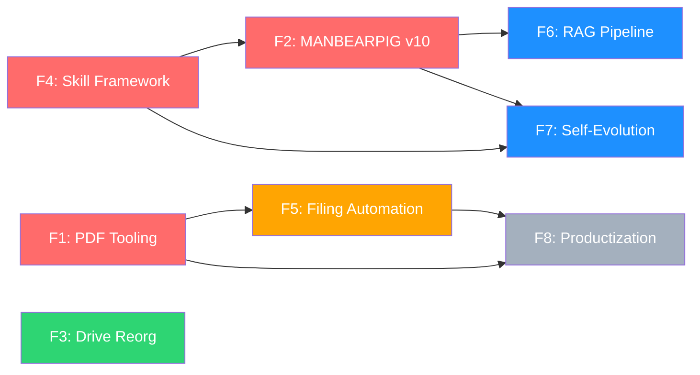

# LitigationOS Engineering Roadmap — Project Plan

## 1. Project Overview

### Feature Summary

LitigationOS Engineering Roadmap encompasses 8 major engineering initiatives that transform the system from a single-case litigation tool into a production-grade, self-evolving, multi-tenant platform. These initiatives span infrastructure (PDF, drives, skills), AI architecture (MANBEARPIG v10, RAG, self-evolution), process automation (filing), and product (multi-tenant SaaS).

### Success Criteria

| KPI | Target | Measurement |
|-----|--------|-------------|
| Filing production | All 12 packages → court-ready PDF | Automated QA score ≥80% |
| AI accuracy | MANBEARPIG v10 intent classification | ≥95% on 200-query test set |
| Retrieval quality | RAG pipeline NDCG@10 | ≥0.7 on 50-query benchmark |
| Drive efficiency | Dedup across 1.47M files | ≥30% space reclaimed |
| Skill coverage | Registered skills in framework | ≥200 skills with O(1) lookup |
| Self-healing | Automated recovery rate | ≥80% of injected issues |
| Product readiness | Multi-tenant with 3 tiers | Zero cross-tenant data leakage |
| System uptime | Evolution daemon stability | 24h+ without crashes |

### Key Milestones

| # | Milestone | Features Included |
|---|-----------|-------------------|
| M1 | **Foundation** | PDF Tooling + Skill Framework |
| M2 | **Intelligence** | MANBEARPIG v10 + RAG Pipeline |
| M3 | **Automation** | Filing Automation + Drive Reorganization |
| M4 | **Autonomy** | Self-Evolution Daemon |
| M5 | **Product** | Productization (Multi-tenant SaaS) |

### Risk Assessment

| Risk | Impact | Probability | Mitigation |
|------|--------|-------------|------------|
| weasyprint Windows issues | Blocks PDF generation | Medium | reportlab fallback path |
| ONNX Runtime CPU latency | Degrades AI response time | Medium | Model quantization + caching |
| I: drive disconnection | Corrupts dedup migration | High | Per-wave checkpoints + rollback |
| Shadow module conflicts | Python import failures | High | Never CWD to repo root |
| EAGAIN pipe overflow | Session crash | Critical | Zero-pipe orchestration architecture |
| Context overflow (GOAWAY 503) | Agent work lost | High | Checkpoint every 5 min / 3 agents |

---

## 2. Work Item Hierarchy

```mermaid
graph TD
    EPIC[Epic: LitigationOS Engineering Roadmap] --> F1[Feature: PDF Tooling]
    EPIC --> F2[Feature: MANBEARPIG v10]
    EPIC --> F3[Feature: Drive Reorganization]
    EPIC --> F4[Feature: Skill Framework]
    EPIC --> F5[Feature: Filing Automation]
    EPIC --> F6[Feature: RAG Pipeline]
    EPIC --> F7[Feature: Self-Evolution]
    EPIC --> F8[Feature: Productization]

    F1 --> S1A[Story: Court CSS Templates]
    F1 --> E1A[Enabler: weasyprint Install]
    F1 --> S1B[Story: PDF Generator Engine]
    F1 --> S1C[Story: Batch Generation]

    F2 --> E2A[Enabler: Training Data Extraction]
    F2 --> S2A[Story: Neural Intent Classifier]
    F2 --> S2B[Story: Ensemble Scoring]
    F2 --> S2C[Story: Self-Evolution v3]

    F3 --> S3A[Story: Full Drive Inventory]
    F3 --> S3B[Story: Hash-Based Dedup]
    F3 --> S3C[Story: Content-Based Dedup]
    F3 --> S3D[Story: Taxonomy Migration]

    F4 --> E4A[Enabler: Skill Contract ABC]
    F4 --> S4A[Story: Skill Registry]
    F4 --> S4B[Story: Auto-Discovery Scanner]
    F4 --> S4C[Story: Skill Chaining]

    F5 --> S5A[Story: Packet Builder]
    F5 --> S5B[Story: SCAO Form Filler]
    F5 --> S5C[Story: Pre-Filing QA v2]

    F6 --> E6A[Enabler: Vector Store Setup]
    F6 --> S6A[Story: Vector Search]
    F6 --> S6B[Story: Cross-Encoder Reranker]
    F6 --> S6C[Story: Knowledge Graph]
    F6 --> S6D[Story: Corrective RAG]

    F7 --> E7A[Enabler: APScheduler Daemon]
    F7 --> S7A[Story: Quality Feedback Loop]
    F7 --> S7B[Story: Self-Healing Monitor]
    F7 --> S7C[Story: Skill Discovery]

    F8 --> E8A[Enabler: Tenant Architecture]
    F8 --> S8A[Story: Jurisdiction Plugins]
    F8 --> S8B[Story: Onboarding Wizard]
    F8 --> S8C[Story: Monetization Tiers]
    F8 --> S8D[Story: Export/Import]

    F1 --> F5
    F4 --> F2
    F2 --> F6
    F2 --> F7
    F4 --> F7
    F1 --> F8
    F5 --> F8
```



---

## 3. GitHub Issues Breakdown

### Epic Issue

```markdown
# Epic: LitigationOS Engineering Roadmap

## Epic Description
Transform LitigationOS from a single-case litigation tool into a production-grade,
self-evolving, multi-tenant platform through 8 coordinated engineering initiatives
spanning infrastructure, AI, automation, and product.

## Business Value
- **Primary Goal**: Court-ready PDF filings, semantic AI queries, autonomous improvement
- **Success Metrics**: 12 PDFs generated, 95% intent accuracy, 200+ skills, 3-tier product
- **User Impact**: Faster filings, better search, zero manual retraining

## Features in this Epic
- [ ] F1 — PDF Tooling (26 tasks)
- [ ] F2 — MANBEARPIG v10 (25 tasks)
- [ ] F3 — Drive Reorganization (26 tasks)
- [ ] F4 — Skill Framework (26 tasks)
- [ ] F5 — Filing Automation (25 tasks)
- [ ] F6 — RAG Pipeline (26 tasks)
- [ ] F7 — Self-Evolution (28 tasks)
- [ ] F8 — Productization (32 tasks)

## Labels
`epic`, `priority-critical`, `value-high`

## Estimate
XXL (214 tasks across 8 features)
```

---

### Feature F1: PDF Tooling

**Priority**: P0 (Critical Path — blocks Filing Automation + Productization)
**Estimate**: L (26 tasks, 4 phases)
**Blocked by**: None
**Blocks**: F5 (Filing Automation), F8 (Productization)

#### Stories

##### S-F1-01: Court-Specific CSS Templates
> As a **pro se litigant**, I want **court-compliant PDF formatting** so that **my filings meet local rules**.

| ID | Type | Title | Priority | Points | Dependencies |
|----|------|-------|----------|--------|--------------|
| F1-TASK-003 | Task | Create `base.css` — shared styles (margins, fonts, spacing) | P0 | 2 | E-F1-01 |
| F1-TASK-004 | Task | Create `circuit.css` — 14th Circuit (1" margins, TNR 12pt, double-space) | P0 | 2 | F1-TASK-003 |
| F1-TASK-005 | Task | Create `coa.css` — Court of Appeals (MCR 7.212(C), 14pt headings) | P1 | 2 | F1-TASK-003 |
| F1-TASK-006 | Task | Create `msc.css`, `federal.css`, `jtc.css` — remaining courts | P1 | 3 | F1-TASK-003 |
| F1-TASK-007 | Task | Create `caption_block.html` Jinja2 template | P0 | 2 | None |
| F1-TASK-008 | Task | Create `footer.html` and `toc.html` Jinja2 templates | P1 | 2 | None |

##### S-F1-02: PDF Generator Engine
> As a **filing system**, I want to **generate PDF from Markdown** so that **filings are court-ready**.

| ID | Type | Title | Priority | Points | Dependencies |
|----|------|-------|----------|--------|--------------|
| F1-TASK-009 | Task | Create `pdf_generator.py` — `PDFGenerator` class | P0 | 3 | E-F1-01, S-F1-01 |
| F1-TASK-010 | Task | Implement `generate()`: MD → HTML → PDF pipeline | P0 | 5 | F1-TASK-009 |
| F1-TASK-011 | Task | Implement TOC generation from H1-H4 headings | P1 | 3 | F1-TASK-010 |
| F1-TASK-012 | Task | Implement TOA generation from `[CITE:]` markers | P1 | 3 | F1-TASK-010 |
| F1-TASK-013 | Task | Implement caption block from DB via Jinja2 | P0 | 2 | F1-TASK-007, F1-TASK-010 |
| F1-TASK-014 | Task | Implement page numbering and header/footer | P1 | 2 | F1-TASK-010 |
| F1-TASK-015 | Task | Implement Bates numbering for exhibits | P2 | 3 | F1-TASK-010 |
| F1-TASK-016 | Task | Implement DRAFT watermark mode | P3 | 1 | F1-TASK-010 |

##### S-F1-03: Batch Generation & Integration
> As a **litigation system**, I want **batch PDF generation** so that **all 12 packages can be produced at once**.

| ID | Type | Title | Priority | Points | Dependencies |
|----|------|-------|----------|--------|--------------|
| F1-TASK-017 | Task | Implement `batch_generate()` for directory processing | P1 | 3 | S-F1-02 |
| F1-TASK-018 | Task | Create `pdf_generation_log` table in DB | P1 | 1 | None |
| F1-TASK-019 | Task | Integrate with `FilingProductionPipeline` — add PDF step | P0 | 3 | S-F1-02 |
| F1-TASK-020 | Task | Generate PDFs for 3 clerk-ready filings | P0 | 2 | F1-TASK-019 |
| F1-TASK-021 | Task | Generate PDFs for all 12 packages (PKG01-12) | P1 | 3 | F1-TASK-020 |

#### Enablers

##### E-F1-01: PDF Library Installation
| ID | Type | Title | Priority | Points |
|----|------|-------|----------|--------|
| F1-TASK-001 | Enabler | Install `weasyprint` in pytools_venv | P0 | 1 |
| F1-TASK-002 | Enabler | Install `reportlab markdown Jinja2 pdfplumber` fallbacks | P0 | 1 |

#### Tests

| ID | Type | Title | Priority | Points | Dependencies |
|----|------|-------|----------|--------|--------------|
| F1-TEST-022 | Test | Unit tests for template rendering per court type | P1 | 2 | S-F1-02 |
| F1-TEST-023 | Test | Integration test: full MD → validated PDF pipeline | P0 | 3 | S-F1-03 |
| F1-TEST-024 | Test | Verify PDF compliance (margins, fonts, spacing) | P1 | 2 | S-F1-02 |
| F1-TEST-025 | Test | Verify TOC page references match content pages | P2 | 2 | F1-TASK-011 |
| F1-TEST-026 | Test | Verify all 12 generated PDFs are valid | P1 | 2 | F1-TASK-021 |

---

### Feature F2: MANBEARPIG v10

**Priority**: P0 (Critical Path — powers all AI features)
**Estimate**: XL (25 tasks, 4 phases)
**Blocked by**: F4 (Skill Framework — for skill expansion)
**Blocks**: F6 (RAG Pipeline), F7 (Self-Evolution)

#### Stories

##### S-F2-01: Neural Intent Classifier
> As a **user querying MANBEARPIG**, I want **semantic intent classification** so that **queries route to the correct skill**.

| ID | Type | Title | Priority | Points | Dependencies |
|----|------|-------|----------|--------|--------------|
| F2-TASK-001 | Task | Extract 5,000+ query-intent pairs from DB query logs | P0 | 3 | None |
| F2-TASK-002 | Task | Define 20+ intent categories | P0 | 2 | None |
| F2-TASK-003 | Task | Train sentence-transformer classifier (all-MiniLM-L6-v2) | P0 | 5 | F2-TASK-001 |
| F2-TASK-004 | Task | Export trained model to ONNX | P0 | 3 | F2-TASK-003 |
| F2-TASK-005 | Task | Create `neural_intent_v2.py` — ONNX classifier | P0 | 3 | F2-TASK-004 |
| F2-TASK-006 | Task | Benchmark ≥95% accuracy on held-out 200 queries | P0 | 2 | F2-TASK-005 |
| F2-TASK-007 | Task | Integrate as primary router in inference_engine.py | P0 | 3 | F2-TASK-006 |

##### S-F2-02: Ensemble Scoring Framework
> As a **retrieval system**, I want **multi-signal fusion** so that **results combine TF-IDF, BM25, dense, and cross-encoder scores**.

| ID | Type | Title | Priority | Points | Dependencies |
|----|------|-------|----------|--------|--------------|
| F2-TASK-008 | Task | Refactor `ensemble_scorer.py` for pluggable scorers | P1 | 3 | None |
| F2-TASK-009 | Task | Add dense vector scorer (cosine similarity) | P1 | 3 | S-F2-01 |
| F2-TASK-010 | Task | Add cross-encoder reranker (ONNX ms-marco-MiniLM) | P1 | 5 | F2-TASK-009 |
| F2-TASK-011 | Task | Implement RRF fusion across all scorer signals | P0 | 3 | F2-TASK-010 |
| F2-TASK-012 | Task | Add adaptive weight tuning from relevance feedback | P2 | 3 | F2-TASK-011 |
| F2-TASK-013 | Task | Benchmark: NDCG@10 ≥15% over v9 baseline | P1 | 2 | F2-TASK-011 |

##### S-F2-03: Self-Evolution v3
> As a **system**, I want **autonomous retraining** so that **models improve from quality feedback**.

| ID | Type | Title | Priority | Points | Dependencies |
|----|------|-------|----------|--------|--------------|
| F2-TASK-014 | Task | Create `quality_feedback` table for query-answer-rating | P1 | 1 | None |
| F2-TASK-015 | Task | Build error pattern analyzer | P1 | 3 | F2-TASK-014 |
| F2-TASK-016 | Task | Build incremental retraining pipeline | P1 | 5 | S-F2-01 |
| F2-TASK-017 | Task | Build shadow validation (test before swap) | P0 | 3 | F2-TASK-016 |
| F2-TASK-018 | Task | Implement quality gate (reject regressions) | P0 | 2 | F2-TASK-017 |
| F2-TASK-019 | Task | Create `evolution_state` metrics dashboard | P2 | 2 | F2-TASK-018 |

##### S-F2-04: Skill Expansion & Testing
| ID | Type | Title | Priority | Points | Dependencies |
|----|------|-------|----------|--------|--------------|
| F2-TASK-020 | Task | Implement 45 new skills (→100+ total) | P1 | 8 | F4 |
| F2-TASK-021 | Task | Create 200-query test set JSON | P0 | 3 | S-F2-01 |
| F2-TASK-022 | Test | Unit tests for all new components | P1 | 3 | S-F2-01, S-F2-02 |
| F2-TASK-023 | Test | Benchmark suite: accuracy, latency, memory | P1 | 3 | F2-TASK-022 |
| F2-TASK-024 | Test | Regression: all 140+ JSON-RPC methods pass | P0 | 2 | All |
| F2-TASK-025 | Task | Update version string to v10.0 | P1 | 1 | F2-TASK-024 |

---

### Feature F3: Drive Reorganization

**Priority**: P2 (Independent — no blockers, no dependents)
**Estimate**: L (26 tasks, 5 phases)
**Blocked by**: None
**Blocks**: None

#### Stories

##### S-F3-01: Full Drive Inventory
| ID | Type | Title | Priority | Points | Dependencies |
|----|------|-------|----------|--------|--------------|
| F3-TASK-001 | Task | Expand `drive_file_index` to full 1.47M rows | P1 | 5 | None |
| F3-TASK-002 | Task | Compute SHA-256 for every file (batch, C→D→F→G→H→I) | P1 | 8 | F3-TASK-001 |
| F3-TASK-003 | Task | Detect MIME types via extension + magic bytes | P2 | 3 | F3-TASK-001 |
| F3-TASK-004 | Task | Index file metadata (size, created, modified, depth) | P2 | 2 | F3-TASK-001 |
| F3-TASK-005 | Task | Generate per-drive inventory summary | P2 | 1 | F3-TASK-001 |

##### S-F3-02: Hash-Based Dedup
| ID | Type | Title | Priority | Points | Dependencies |
|----|------|-------|----------|--------|--------------|
| F3-TASK-006 | Task | Query SHA-256 clusters (same hash, multiple paths) | P1 | 2 | S-F3-01 |
| F3-TASK-007 | Task | Designate canonical file per cluster (C:\ preferred) | P1 | 2 | F3-TASK-006 |
| F3-TASK-008 | Task | Generate dedup plan: source → dest mapping | P1 | 2 | F3-TASK-007 |
| F3-TASK-009 | Task | Execute wave 1: move 1,000 hash-duplicates to I:\ | P1 | 3 | F3-TASK-008 |
| F3-TASK-010 | Task | Verify integrity: SHA-256 post-move matches original | P0 | 2 | F3-TASK-009 |
| F3-TASK-011 | Task | Continue waves until complete | P1 | 5 | F3-TASK-010 |

##### S-F3-03: Content-Based Dedup
| ID | Type | Title | Priority | Points | Dependencies |
|----|------|-------|----------|--------|--------------|
| F3-TASK-012 | Task | Build content extractor (PDF→text, DOCX→text, MD/TXT→direct) | P1 | 5 | None |
| F3-TASK-013 | Task | Compare content for same-name/size files with different hashes | P1 | 3 | F3-TASK-012 |
| F3-TASK-014 | Task | Compute similarity (edit distance/Jaccard, ≥0.95 threshold) | P1 | 3 | F3-TASK-013 |
| F3-TASK-015 | Task | Designate canonical (newest version, canonical path) | P1 | 2 | F3-TASK-014 |
| F3-TASK-016 | Task | Execute content-dedup waves (1,000/wave) | P1 | 5 | F3-TASK-015 |

##### S-F3-04: Taxonomy Migration
| ID | Type | Title | Priority | Points | Dependencies |
|----|------|-------|----------|--------|--------------|
| F3-TASK-017 | Task | Define canonical taxonomy (get Andrew's approval) | P1 | 2 | None |
| F3-TASK-018 | Task | Identify orphan files not in canonical or duplicate | P1 | 2 | S-F3-02, S-F3-03 |
| F3-TASK-019 | Task | Generate migration plan (orphan → canonical mapping) | P1 | 2 | F3-TASK-018 |
| F3-TASK-020 | Task | Execute migration waves (1,000/wave with checkpoint) | P1 | 5 | F3-TASK-019 |
| F3-TASK-021 | Task | Update all DB references to canonical locations | P0 | 3 | F3-TASK-020 |
| F3-TASK-022 | Task | Build unified search index across canonical locations | P2 | 3 | F3-TASK-021 |

##### Tests
| ID | Type | Title | Priority | Points | Dependencies |
|----|------|-------|----------|--------|--------------|
| F3-TEST-023 | Test | Post-migration SHA-256 manifest | P0 | 2 | S-F3-04 |
| F3-TEST-024 | Test | Pre/post manifest comparison (zero data loss) | P0 | 2 | F3-TEST-023 |
| F3-TEST-025 | Test | All DB references point to existing files | P0 | 2 | F3-TASK-021 |
| F3-TEST-026 | Test | Final report: files moved, space reclaimed | P2 | 1 | All |

---

### Feature F4: Skill Framework

**Priority**: P0 (Foundation — enables MANBEARPIG v10 skill expansion + Self-Evolution)
**Estimate**: L (26 tasks, 5 phases)
**Blocked by**: None
**Blocks**: F2 (skill expansion), F7 (skill auto-discovery)

#### Stories

##### S-F4-01: Skill Contract & Registry
| ID | Type | Title | Priority | Points | Dependencies |
|----|------|-------|----------|--------|--------------|
| F4-TASK-001 | Task | Create `skill_contract.py` — ABC with execute/validate/health_check | P0 | 3 | None |
| F4-TASK-002 | Task | Create `skill_registry` table in DB | P0 | 1 | None |
| F4-TASK-003 | Task | Create `skill_registry.py` — register/lookup/search | P0 | 3 | F4-TASK-001, F4-TASK-002 |
| F4-TASK-004 | Task | Implement `@register_skill()` decorator | P0 | 2 | F4-TASK-003 |
| F4-TASK-005 | Task | Implement `SkillMetadata` dataclass | P0 | 1 | F4-TASK-001 |

##### S-F4-02: Auto-Discovery Scanner
| ID | Type | Title | Priority | Points | Dependencies |
|----|------|-------|----------|--------|--------------|
| F4-TASK-006 | Task | Create `skill_scanner.py` — filesystem scanner | P0 | 3 | S-F4-01 |
| F4-TASK-007 | Task | Scan `local_model/skills/` (55 modules) | P0 | 2 | F4-TASK-006 |
| F4-TASK-008 | Task | Scan `engines/skill_*.py` (14 modules) | P0 | 2 | F4-TASK-006 |
| F4-TASK-009 | Task | Scan `.agents/skills/` (90+ Copilot skills) | P1 | 2 | F4-TASK-006 |
| F4-TASK-010 | Task | Auto-register discovered skills into DB | P0 | 2 | F4-TASK-007 |
| F4-TASK-011 | Task | Version comparison and upgrade detection | P1 | 3 | F4-TASK-010 |

##### S-F4-03: Skill Chaining
| ID | Type | Title | Priority | Points | Dependencies |
|----|------|-------|----------|--------|--------------|
| F4-TASK-012 | Task | Create `skill_chain_executor.py` | P1 | 3 | S-F4-01 |
| F4-TASK-013 | Task | Define YAML chain config format | P1 | 2 | F4-TASK-012 |
| F4-TASK-014 | Task | Implement typed data flow between skills | P1 | 3 | F4-TASK-013 |
| F4-TASK-015 | Task | Create 3 default chains (evidence→filing, query→answer, doc→claims) | P1 | 3 | F4-TASK-014 |
| F4-TASK-016 | Task | Handle chain failures (skip + partial pass) | P1 | 2 | F4-TASK-014 |

##### S-F4-04: Auto-Evolution & Dashboard
| ID | Type | Title | Priority | Points | Dependencies |
|----|------|-------|----------|--------|--------------|
| F4-TASK-017 | Task | Track per-skill metrics (invocations, errors, latency) | P1 | 2 | S-F4-01 |
| F4-TASK-018 | Task | Flag skills with >5% error rate | P2 | 2 | F4-TASK-017 |
| F4-TASK-019 | Task | Auto-upgrade on new version detection | P2 | 3 | F4-TASK-011 |
| F4-TASK-020 | Task | Build SQL performance dashboard | P2 | 2 | F4-TASK-017 |
| F4-TASK-021 | Task | Integrate with MANBEARPIG v10 evolution cycle | P2 | 2 | F2, F4-TASK-019 |

##### Migration & Tests
| ID | Type | Title | Priority | Points | Dependencies |
|----|------|-------|----------|--------|--------------|
| F4-TASK-022 | Task | Migrate top 20 skills to SkillContract | P1 | 5 | S-F4-01 |
| F4-TEST-023 | Test | All 55+ skills register successfully | P0 | 2 | S-F4-02 |
| F4-TEST-024 | Test | Chain executes 4 skills with correct data flow | P1 | 2 | S-F4-03 |
| F4-TEST-025 | Test | Registry lookup <1ms for 200 skills | P1 | 1 | S-F4-01 |
| F4-TASK-026 | Task | Upgrade remaining 27 agent skills | P2 | 5 | F4-TASK-022 |

---

### Feature F5: Filing Automation

**Priority**: P0 (Directly produces court filings)
**Estimate**: L (25 tasks, 4 phases)
**Blocked by**: F1 (PDF Tooling — for final output)
**Blocks**: F8 (Productization)

#### Stories

##### S-F5-01: Filing Packet Builder
| ID | Type | Title | Priority | Points | Dependencies |
|----|------|-------|----------|--------|--------------|
| F5-TASK-001 | Task | Create `filing_packet_builder.py` | P0 | 3 | None |
| F5-TASK-002 | Task | Builder pattern: add_motion, add_brief, add_exhibits | P0 | 3 | F5-TASK-001 |
| F5-TASK-003 | Task | Auto-generate proof of service (MC 12) | P0 | 3 | F5-TASK-001 |
| F5-TASK-004 | Task | Auto-generate cover sheet | P1 | 2 | F5-TASK-001 |
| F5-TASK-005 | Task | Auto-generate fee waiver (MC 20) for IFP | P2 | 2 | F5-TASK-001 |
| F5-TASK-006 | Task | Build packet manifest (JSON + checksums) | P1 | 2 | F5-TASK-002 |

##### S-F5-02: SCAO Form Filler
| ID | Type | Title | Priority | Points | Dependencies |
|----|------|-------|----------|--------|--------------|
| F5-TASK-007 | Task | Create `scao_form_filler.py` | P0 | 3 | None |
| F5-TASK-008 | Task | Map MC 12 form fields to DB columns | P0 | 2 | F5-TASK-007 |
| F5-TASK-009 | Task | Map MC 20 form fields | P1 | 2 | F5-TASK-007 |
| F5-TASK-010 | Task | Map CC 79, CC 88, CC 298 fields | P1 | 3 | F5-TASK-007 |
| F5-TASK-011 | Task | Implement PDF form filling via pdfrw/PyPDF2 | P0 | 5 | F5-TASK-008 |
| F5-TASK-012 | Task | Handle field overflow (truncate + log) | P2 | 1 | F5-TASK-011 |
| F5-TASK-013 | Task | Validate all required fields populated | P1 | 2 | F5-TASK-011 |

##### S-F5-03: Pre-Filing QA v2
| ID | Type | Title | Priority | Points | Dependencies |
|----|------|-------|----------|--------|--------------|
| F5-TASK-014 | Task | Create `prefiling_qa_v2.py` | P0 | 3 | None |
| F5-TASK-015 | Task | Implement 10 readiness dimensions with weighted scoring | P0 | 5 | F5-TASK-014 |
| F5-TASK-016 | Task | Checks: placeholder scan, citation verify, party name | P0 | 3 | F5-TASK-015 |
| F5-TASK-017 | Task | Checks: case number format, page limits, signature | P1 | 3 | F5-TASK-015 |
| F5-TASK-018 | Task | Checks: PoS completeness, exhibit refs, formatting | P1 | 3 | F5-TASK-015 |
| F5-TASK-019 | Task | GO/NO-GO decision logic with override | P0 | 2 | F5-TASK-016 |
| F5-TASK-020 | Task | Generate detailed QA report per filing | P1 | 3 | F5-TASK-019 |

##### Integration & Tests
| ID | Type | Title | Priority | Points | Dependencies |
|----|------|-------|----------|--------|--------------|
| F5-TASK-021 | Task | Integrate all into FilingProductionPipeline | P0 | 3 | S-F5-01, S-F5-02, S-F5-03 |
| F5-TASK-022 | Task | Process 3 clerk-ready filings end-to-end | P0 | 3 | F1, F5-TASK-021 |
| F5-TASK-023 | Task | Batch process all 12 packages | P1 | 5 | F5-TASK-022 |
| F5-TEST-024 | Test | Unit + integration tests | P1 | 3 | F5-TASK-021 |
| F5-TEST-025 | Test | Validate filled forms are valid PDFs | P1 | 2 | F5-TASK-011 |

---

### Feature F6: RAG Pipeline

**Priority**: P1 (Enhances AI — depends on MANBEARPIG v10)
**Estimate**: L (26 tasks, 5 phases)
**Blocked by**: F2 (ensemble scoring for fusion)
**Blocks**: None (enhances F7 self-evolution quality)

#### Stories

##### S-F6-01: Vector Search
| ID | Points | Title | Dependencies |
|----|--------|-------|--------------|
| F6-TASK-001 | 2 | Choose vector store (chromadb vs SQLite ANN) | None |
| F6-TASK-002 | 3 | Create `vector_indexer.py` — batch embedding | F6-TASK-001 |
| F6-TASK-003 | 5 | Generate embeddings for 100K docs | F6-TASK-002 |
| F6-TASK-004 | 3 | Build vector index | F6-TASK-003 |
| F6-TASK-005 | 3 | Incremental index update (<60s) | F6-TASK-004 |
| F6-TASK-006 | 2 | Benchmark: 20 test queries return relevant results | F6-TASK-004 |

##### S-F6-02: Cross-Encoder Reranker
| ID | Points | Title | Dependencies |
|----|--------|-------|--------------|
| F6-TASK-007 | 3 | Export ms-marco-MiniLM to ONNX | None |
| F6-TASK-008 | 3 | Create `cross_encoder_reranker.py` | F6-TASK-007 |
| F6-TASK-009 | 3 | Top-50 → rescore → top-10 | F6-TASK-008, S-F6-01 |
| F6-TASK-010 | 2 | Benchmark: NDCG@10 ≥20% over BM25 | F6-TASK-009 |

##### S-F6-03: Knowledge Graph
| ID | Points | Title | Dependencies |
|----|--------|-------|--------------|
| F6-TASK-011 | 2 | Create KG tables (entities, relationships, document links) | None |
| F6-TASK-012 | 3 | Populate entities from DB (cases, rules, parties, judges) | F6-TASK-011 |
| F6-TASK-013 | 3 | Populate relationships (cites, involves, presided_by) | F6-TASK-012 |
| F6-TASK-014 | 3 | Create `kg_retriever.py` — graph-enhanced retrieval | F6-TASK-013 |
| F6-TASK-015 | 5 | Query → entity extraction → graph traversal → merge | F6-TASK-014 |

##### S-F6-04: Corrective RAG & Integration
| ID | Points | Title | Dependencies |
|----|--------|-------|--------------|
| F6-TASK-016 | 3 | Create `corrective_rag_v2.py` | S-F6-01 |
| F6-TASK-017 | 3 | Score top-3 → if <0.5 → expand → re-retrieve | F6-TASK-016 |
| F6-TASK-018 | 5 | Unified `RAGPipeline` class | S-F6-01, S-F6-02, S-F6-03 |
| F6-TASK-019 | 3 | RRF fusion across all retriever signals | F6-TASK-018 |
| F6-TASK-020 | 3 | Wire into `HybridRetriever` as enhanced backend | F6-TASK-019 |
| F6-TASK-021 | 3 | Source attribution (document/page/paragraph citations) | F6-TASK-020 |

##### Tests
| ID | Points | Title | Dependencies |
|----|--------|-------|--------------|
| F6-TEST-022 | 3 | Create 50-query test set with relevance judgments | None |
| F6-TEST-023 | 3 | Unit + integration tests | S-F6-04 |
| F6-TEST-024 | 2 | Benchmark: NDCG@10 ≥0.7 | F6-TEST-023 |
| F6-TEST-025 | 2 | Benchmark: P90 latency <2s | F6-TEST-023 |
| F6-TEST-026 | 2 | Benchmark: KG enriches ≥30% of queries | F6-TEST-023 |

---

### Feature F7: Self-Evolution

**Priority**: P1 (Enables autonomous improvement)
**Estimate**: L (28 tasks, 5 phases)
**Blocked by**: F2 (MANBEARPIG v10), F4 (Skill Framework)
**Blocks**: None

#### Stories

##### S-F7-01: Daemon Framework
| ID | Points | Title | Dependencies |
|----|--------|-------|--------------|
| F7-TASK-001 | 1 | Install APScheduler | None |
| F7-TASK-002 | 3 | Create `evolution_daemon.py` — EvolutionDaemon class | F7-TASK-001 |
| F7-TASK-003 | 3 | Daemon start/stop with file-based locking | F7-TASK-002 |
| F7-TASK-004 | 2 | Configurable scheduling (interval/cron/one-shot) | F7-TASK-003 |
| F7-TASK-005 | 3 | Checkpoint/resume to `evolution_state` table | F7-TASK-003 |
| F7-TASK-006 | 2 | Windows service wrapper (pywin32 or nssm) | F7-TASK-004 |

##### S-F7-02: Quality Feedback Loop
| ID | Points | Title | Dependencies |
|----|--------|-------|--------------|
| F7-TASK-007 | 1 | Create `quality_feedback` table | None |
| F7-TASK-008 | 3 | Accuracy tracker: rolling 100-query window | F7-TASK-007 |
| F7-TASK-009 | 3 | Error pattern analyzer: cluster failure modes | F7-TASK-008 |
| F7-TASK-010 | 5 | Incremental retraining from new data | F7-TASK-009, F2 |
| F7-TASK-011 | 3 | Shadow validation (test before swap) | F7-TASK-010 |
| F7-TASK-012 | 2 | Quality gate (reject regressions) | F7-TASK-011 |

##### S-F7-03: Self-Healing Monitor
| ID | Points | Title | Dependencies |
|----|--------|-------|--------------|
| F7-TASK-013 | 3 | Create `self_heal_v2.py` | None |
| F7-TASK-014 | 2 | DB health check (WAL size, locks, connections) | F7-TASK-013 |
| F7-TASK-015 | 2 | Disk space check (6 drives, alert <5% free) | F7-TASK-013 |
| F7-TASK-016 | 2 | Model integrity (SHA-256 verification) | F7-TASK-013 |
| F7-TASK-017 | 3 | Auto-recovery (WAL checkpoint, cleanup, reload) | F7-TASK-014 |
| F7-TASK-018 | 2 | Circuit breaker (3 failures → pause + alert) | F7-TASK-017 |

##### S-F7-04: Skill Discovery & Metrics
| ID | Points | Title | Dependencies |
|----|--------|-------|--------------|
| F7-TASK-019 | 3 | Analyze unhandled intents (<0.5 confidence) | F2, F4 |
| F7-TASK-020 | 3 | Propose new skill definitions | F7-TASK-019 |
| F7-TASK-021 | 2 | Evolution metrics (accuracy, latency, error, coverage) | S-F7-02 |
| F7-TASK-022 | 1 | Write metrics to DB and PROGRESS_LOG.md | F7-TASK-021 |

##### Tests
| ID | Points | Title | Dependencies |
|----|--------|-------|--------------|
| F7-TEST-023 | 3 | Unit + integration tests | All stories |
| F7-TEST-024 | 3 | 24h stability test (simulated accelerated) | S-F7-01 |
| F7-TEST-025 | 2 | Retraining never degrades accuracy | S-F7-02 |
| F7-TEST-026 | 2 | Self-healing resolves ≥80% of issues | S-F7-03 |
| F7-TEST-027 | 2 | Checkpoint/resume after simulated crash | S-F7-01 |
| F7-TEST-028 | 1 | Deploy via Task Scheduler on boot | S-F7-01 |

---

### Feature F8: Productization

**Priority**: P3 (Future — depends on all infrastructure)
**Estimate**: XL (32 tasks, 5 phases)
**Blocked by**: F1, F5 (at minimum — needs PDF + filing working)
**Blocks**: None

#### Stories

##### S-F8-01: Multi-Tenant Architecture
| ID | Points | Title | Dependencies |
|----|--------|-------|--------------|
| F8-TASK-001 | 2 | Create `tenant/` package | None |
| F8-TASK-002 | 5 | TenantManager: create/list/switch/delete | F8-TASK-001 |
| F8-TASK-003 | 3 | Per-tenant SQLite from schema template | F8-TASK-002 |
| F8-TASK-004 | 5 | TenantContext: thread-local binding | F8-TASK-003 |
| F8-TASK-005 | 2 | Tenant data directory structure | F8-TASK-002 |
| F8-TASK-006 | 5 | Migrate DatabaseManager to tenant-aware | F8-TASK-004 |
| F8-TASK-007 | 3 | Tenant isolation tests | F8-TASK-006 |

##### S-F8-02: Jurisdiction Plugins
| ID | Points | Title | Dependencies |
|----|--------|-------|--------------|
| F8-TASK-008 | 3 | JurisdictionPlugin ABC in `plugins/base.py` | None |
| F8-TASK-009 | 2 | Define interface: get_rules/forms/deadline/validate | F8-TASK-008 |
| F8-TASK-010 | 5 | Extract Michigan rules into MI plugin | F8-TASK-009 |
| F8-TASK-011 | 3 | Extract Michigan forms catalog | F8-TASK-010 |
| F8-TASK-012 | 3 | Extract Michigan deadline rules | F8-TASK-010 |
| F8-TASK-013 | 3 | Plugin loader (runtime discovery) | F8-TASK-009 |
| F8-TASK-014 | 2 | Generic template jurisdiction | F8-TASK-009 |

##### S-F8-03: Case Onboarding Wizard
| ID | Points | Title | Dependencies |
|----|--------|-------|--------------|
| F8-TASK-015 | 3 | Design 8-step wizard UI (CustomTkinter) | None |
| F8-TASK-016 | 3 | Steps 1-3: Case type → Jurisdiction → Parties | F8-TASK-015 |
| F8-TASK-017 | 3 | Steps 4-6: Numbers → Judge/Attorney → Dates | F8-TASK-016 |
| F8-TASK-018 | 3 | Steps 7-8: Evidence import → Review & Create | F8-TASK-017 |
| F8-TASK-019 | 2 | Case templates (custody, housing, tort, civil rights) | F8-TASK-015 |
| F8-TASK-020 | 3 | Wire wizard → TenantManager | S-F8-01, F8-TASK-018 |

##### S-F8-04: Monetization Tiers
| ID | Points | Title | Dependencies |
|----|--------|-------|--------------|
| F8-TASK-021 | 3 | FeatureFlagManager with tier-based gates | None |
| F8-TASK-022 | 2 | Free tier: 1 case, 500 MB | F8-TASK-021 |
| F8-TASK-023 | 2 | Pro tier: 5 cases, 5 GB, all engines | F8-TASK-021 |
| F8-TASK-024 | 2 | Enterprise tier: unlimited | F8-TASK-021 |
| F8-TASK-025 | 3 | Upgrade flow (upsell at limits) | F8-TASK-022 |
| F8-TASK-026 | 5 | License key validation (offline-capable) | F8-TASK-021 |

##### S-F8-05: Export, Import & Docs
| ID | Points | Title | Dependencies |
|----|--------|-------|--------------|
| F8-TASK-027 | 5 | Case export: ZIP with all data | S-F8-01 |
| F8-TASK-028 | 5 | Case import: restore from ZIP | F8-TASK-027 |
| F8-TASK-029 | 3 | Process blueprint documentation | None |
| F8-TASK-030 | 3 | Landing page content + screenshots | F8-TASK-029 |
| F8-TASK-031 | 5 | Product installer (PyInstaller + NSIS/MSI) | All |
| F8-TASK-032 | 3 | User documentation | F8-TASK-031 |

---

## 4. Priority and Value Matrix

| Priority | Value | Features | Labels |
|----------|-------|----------|--------|
| P0 | High | F1 (PDF), F4 (Skills), F5 (Filing) | `priority-critical`, `value-high` |
| P0 | High | F2 (MANBEARPIG v10) — AI core | `priority-critical`, `value-high` |
| P1 | High | F6 (RAG), F7 (Self-Evolution) | `priority-high`, `value-high` |
| P2 | Medium | F3 (Drive Reorg) — independent | `priority-medium`, `value-medium` |
| P3 | Medium | F8 (Productization) — future | `priority-low`, `value-medium` |

---

## 5. Estimation Summary

| Feature | Tasks | Story Points | T-Shirt |
|---------|-------|-------------|---------|
| F1: PDF Tooling | 26 | 58 | L |
| F2: MANBEARPIG v10 | 25 | 76 | XL |
| F3: Drive Reorganization | 26 | 71 | XL |
| F4: Skill Framework | 26 | 60 | L |
| F5: Filing Automation | 25 | 68 | L |
| F6: RAG Pipeline | 26 | 75 | XL |
| F7: Self-Evolution | 28 | 62 | L |
| F8: Productization | 32 | 101 | XXL |
| **TOTAL** | **214** | **571** | **XXL** |

---

## 6. Dependency Graph (Critical Path)



**Critical Path A (AI):** F4 → F2 → F6 → (F7 can parallel with F6)
**Critical Path B (Filing):** F1 → F5 → F8
**Independent:** F3 (can start anytime, no blockers)

### Dependency Types

| From | To | Type | Reason |
|------|----|------|--------|
| F4 → F2 | Prerequisite | Skill framework needed for 45 new skills |
| F2 → F6 | Prerequisite | Ensemble scoring feeds into RAG fusion |
| F2 → F7 | Prerequisite | Quality feedback needs v10 metrics |
| F4 → F7 | Prerequisite | Skill discovery needs skill registry |
| F1 → F5 | Prerequisite | Filing automation needs PDF output |
| F1 → F8 | Prerequisite | Product needs PDF generation |
| F5 → F8 | Prerequisite | Product needs filing pipeline |

---

## 7. Sprint Planning Template

### Recommended Sprint Sequence

#### Sprint 1 — Foundation (F4 Phase 1 + F1 Phase 1)
| Feature | Tasks | Points |
|---------|-------|--------|
| F4: Skill Contract & Registry | TASK-001 through TASK-005 | 10 |
| F1: PDF Dependencies & Templates | TASK-001 through TASK-008 | 15 |
| F3: Drive Inventory (parallel) | TASK-001 | 5 |
| **Sprint Total** | 14 tasks | **30 points** |

#### Sprint 2 — Core Engines (F4 Phase 2 + F1 Phase 2)
| Feature | Tasks | Points |
|---------|-------|--------|
| F4: Auto-Discovery Scanner | TASK-006 through TASK-011 | 14 |
| F1: PDF Generator Engine | TASK-009 through TASK-016 | 22 |
| F3: Hash-Based Dedup | TASK-002 through TASK-005 | 14 |
| **Sprint Total** | 20 tasks | **50 points** |

#### Sprint 3 — AI Core (F2 Phase 1 + F4 Phase 3)
| Feature | Tasks | Points |
|---------|-------|--------|
| F2: Neural Intent Classifier | TASK-001 through TASK-007 | 21 |
| F4: Skill Chaining | TASK-012 through TASK-016 | 13 |
| F1: Batch & Integration | TASK-017 through TASK-021 | 12 |
| **Sprint Total** | 18 tasks | **46 points** |

#### Sprint 4 — Ensemble + Filing (F2 Phase 2 + F5 Phase 1-2)
| Feature | Tasks | Points |
|---------|-------|--------|
| F2: Ensemble Scoring | TASK-008 through TASK-013 | 19 |
| F5: Packet Builder + SCAO | TASK-001 through TASK-013 | 32 |
| **Sprint Total** | 19 tasks | **51 points** |

#### Sprint 5 — QA + RAG (F5 Phase 3 + F6 Phase 1-2)
| Feature | Tasks | Points |
|---------|-------|--------|
| F5: Pre-Filing QA v2 | TASK-014 through TASK-020 | 22 |
| F6: Vector Search + Reranker | TASK-001 through TASK-010 | 27 |
| **Sprint Total** | 17 tasks | **49 points** |

#### Sprint 6 — KG + Evolution (F6 Phase 3-4 + F7 Phase 1-2)
| Feature | Tasks | Points |
|---------|-------|--------|
| F6: Knowledge Graph + Corrective RAG | TASK-011 through TASK-021 | 36 |
| F7: Daemon + Quality Feedback | TASK-001 through TASK-012 | 26 |
| **Sprint Total** | 23 tasks | **62 points** |

#### Sprint 7 — Healing + Integration (F7 Phase 3-5 + F5 Phase 4)
| Feature | Tasks | Points |
|---------|-------|--------|
| F7: Self-Healing + Discovery + Tests | TASK-013 through TASK-028 | 36 |
| F5: Integration + Batch | TASK-021 through TASK-025 | 16 |
| **Sprint Total** | 21 tasks | **52 points** |

#### Sprint 8 — Product (F8 all phases)
| Feature | Tasks | Points |
|---------|-------|--------|
| F8: Multi-Tenant + Plugins + Wizard | TASK-001 through TASK-032 | 101 |
| **Sprint Total** | 32 tasks | **101 points** |

#### Sprint 9 — Testing & Finalization
| Feature | Tasks | Points |
|---------|-------|--------|
| All features: remaining tests + polish | Mixed | ~40 |
| **Sprint Total** | ~15 tasks | **~40 points** |

---

## 8. GitHub Project Board Configuration

### Column Structure (Kanban)

| Column | Description | Entry Criteria |
|--------|-------------|---------------|
| **Backlog** | All 214 tasks, prioritized | Created with labels |
| **Sprint Ready** | Detailed, estimated, dependencies met | All blockers resolved |
| **In Progress** | Currently being worked on | Assigned, sprint committed |
| **In Review** | Code review / testing | PR submitted |
| **Testing** | QA validation | Review approved |
| **Done** | Completed and accepted | All acceptance criteria met |

### Custom Fields

| Field | Type | Values |
|-------|------|--------|
| Priority | Select | P0, P1, P2, P3 |
| Value | Select | High, Medium, Low |
| Component | Select | PDF, AI, Data, Filing, Product, Framework |
| Estimate | Number | Story points (1-13) |
| Sprint | Select | Sprint 1-9 |
| Feature | Select | F1-F8 |

### Labels

```
epic, feature, story, enabler, task, test
priority-critical, priority-high, priority-medium, priority-low
value-high, value-medium, value-low
component-pdf, component-ai, component-data, component-filing, component-product, component-framework
milestone-foundation, milestone-intelligence, milestone-automation, milestone-autonomy, milestone-product
```

---

## 9. Automation Rules

### Status Transitions
- PR opened → Move linked issue to "In Review"
- PR merged → Move linked issue to "Done"
- All story tasks "Done" → Move story to "Testing"
- All feature stories "Done" → Move feature to "Testing"

### Notifications
- P0 task blocked >2 days → Alert in `00_SYSTEM/PROGRESS_LOG.md`
- Feature >80% complete → Generate readiness report
- Sprint velocity <70% of commitment → Flag risk

---

*Generated from 8 specification documents and 8 implementation plans.*
*Total scope: 1 Epic, 8 Features, 30 Stories, 12 Enablers, 214 Tasks, 571 Story Points.*
